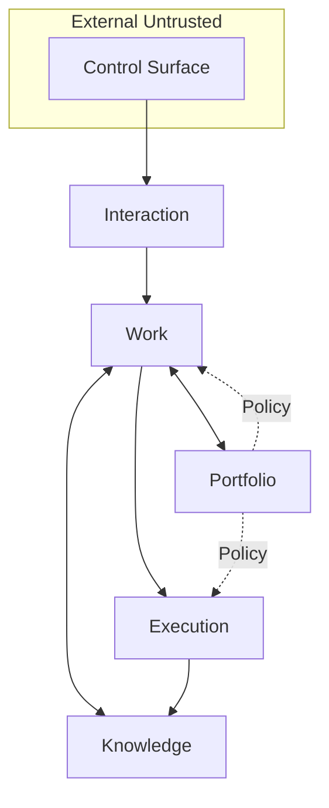

# Architecture Overview

Dieses Dokument ist ein einseitiger Architektur-Überblick. Die vollständige
Spezifikation liegt in [`docs/spec/SPECIFICATION.md`](docs/spec/SPECIFICATION.md)
(arc42-strukturiert), die einzelnen Entscheidungen in
[`docs/decisions/`](docs/decisions/) (MADR-Format).

## Einzeiler

Ein persönliches Multi-Projekt-Steuerungssystem, das **agentische Arbeit
orchestriert, nicht ausführt**. Agent-Tools (Claude Code, Codex CLI) laufen
sandboxed, stateless, headless; der Orchestrator hält Zustand und Policy.

## Fünf Module

| Modul | Verantwortung |
|---|---|
| **Interaction** | Control Surface, HITL-Inbox, Intent, Identität (Single-User-Querschnitt) |
| **Work** | Work-Item-Lifecycle (Intake + Planning + Workflow), durable via DBOS |
| **Execution** | Bounded Agent-Runs (Claude Code headless, Codex CLI exec) in 8-Schichten-MVS |
| **Knowledge** | Observations, Decisions (ADR-Minimal), Standards (4-Stufen-Promotion), Artifacts, Evidence |
| **Portfolio** | Projects, Dependencies, Policy/Binding-Scope als Querschnitt |

## Tech-Stack (V1)

| Schicht | Wahl |
|---|---|
| Durable Execution | DBOS (ADR-0002) |
| Primärspeicher | SQLite WAL + Litestream → Object Storage (ADR-0003) |
| Upgrade-Pfad | Postgres auf kleinem VPS |
| LLM-Wrapper | Pydantic AI (**kein** LangGraph/Agents-SDK) (ADR-0004) |
| Agent-Aufruf | Claude Code headless + Codex CLI exec (ADR-0004) |
| Sandbox | 8-Schichten-MVS (ADR-0006) |
| HITL | Inbox-Kaskade 4h/24h/72h (ADR-0007) |
| Budget | 4-Scope-Gate als Middleware (ADR-0008) |

## Bewusst NICHT in V1

Multi-User, Cloud-Orchestrator, dedizierter Event-Broker, LangGraph,
OpenAI/Anthropic Agent-SDKs, Temporal, Multi-Device-Sync, Approval-Delegation.

## Weiter lesen

- Volle Spec: [`docs/spec/SPECIFICATION.md`](docs/spec/SPECIFICATION.md)
- Entscheidungen einzeln: [`docs/decisions/`](docs/decisions/)
- Evidenz-Basis: [`docs/research/`](docs/research/)
