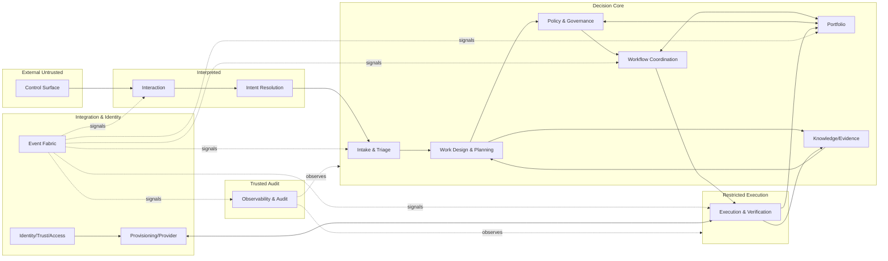

# Review: Architektur-Stresstest

Dieses Dokument ist eine externe Herz-und-Nieren-Prüfung der Dokumente `00-README.md`
bis `11-glossary.md`. Es ändert die Originale nicht. Zweck: aufzeigen, wie vollständig
und realistisch das beschriebene System ist, was fehlt und was zu viel ist.

## TL;DR

Das Paket ist eine innerlich konsistente Architektur-Erzählung, aber:

- für einen erklärten Single-User-Kontext deutlich überdimensioniert (13 Bounded Contexts,
  Trust-Zonen-Taxonomie, Event Fabric und Audit als eigene Domänen);
- implementierungsseitig praktisch leer — keine Persistenz, keine Runtime, keine
  Schnittstellen, kein Execution-Isolationsmechanismus, kein MVP-Pfad;
- die namentliche Zielumgebung (Codex CLI, Claude Code) wird nirgendwo auf die
  Architektur gemappt — `07-implementation-handoff.md` wiederholt Prinzipien;
- mehrere Ownership- und Lifecycle-Reibungen, die bei einer Implementierung sofort beißen;
- starke Kernideen (Work Item vs. Workflow, Standards-Promotion, Dependency als Objekt,
  One Owner per State) verdienen Beibehaltung — in kleinerem Rahmen.

## Gesamtbild

Kennzahlen: 13 Kontexte (`04`), 6 Trust-Zonen (`06`), 12 Kernobjekte (`09`),
17 Architekturprinzipien (`02`), 15 Muss- und 10 Darf-nicht-Regeln (`03`),
17 Architecture Decisions (`08`), 7 Lifecycle-Familien (`05`),
6 Betriebsmodi (`10`), 13 Fehlerklassen und 6 Standardreaktionen (`06`).
Für ein erklärtes Single-User-System (`01` §Kernannahmen, `10` §Betriebsprämissen).

## Was realistisch und tragend ist (behalten)

1. **Work Item ≠ Workflow** (AD-05, Guardrail #4). Trennt „was soll getan werden" von
   „Ausführungszustand"; verhindert, dass Prozessfehler das Arbeitsziel umdefinieren.
2. **One Owner per Primary State** (AD-12, Guardrail #2). Pragmatisch stark,
   erzwingt saubere Domänengrenzen.
3. **Standards-Promotion-Pipeline** (`05` Standard-Lifecycle, AD-15). Genau der
   Mechanismus, den ein persönliches Lernsystem braucht, um nicht still zu erodieren.
4. **Dependency als First-Class-Objekt** mit `satisfaction_basis` (`09`). Verhindert
   informelle Cross-Project-Kopplung aus Chatverlauf oder Agent-Memory (AD-14).
5. **AD-17 Reference over Replication**. Vernünftig, sobald mehrere Projekte
   gemeinsame Referenzen teilen.
6. **Trust-Zonen als Denkmodell** (`06`) für Execution-Isolation — richtig, auch wenn
   derzeit überformalisiert.
7. **Escalate-late-Prinzip** (AD-13, `06` §Eskalationsprinzipien). Treibt die richtigen
   Defaults: Clarify, Wait, Retry, Replan vor Mensch.

## Was fehlt (größte Lücken)

### Implementierungssubstanz

- **Persistenz.** Kein Wort zu SQLite, Postgres, Git oder Dateiablage. Ohne
  Speichermodell ist „One Owner per Primary State" (AD-12) unverifizierbar.
- **Runtime für Workflow Coordination.** `04` fordert „langlebige Ablaufsteuerung,
  Wait, Resume, Retry, Compensation" — aber kein Wort zu Daemon, Cron, Temporal,
  Restate, LISTEN/NOTIFY oder einfachem persistiertem Task-Runner.
- **Event-Fabric-Substrat.** Eigener Kontext (`04`), aber kein Transport
  (NATS, Redis Streams, Postgres-Log, Append-Only-Log?), kein Idempotenz-Key-Schema,
  keine Consumer-Gruppen.
- **Control-Surface-Konkretisierung.** Telegram, Slack, Matrix, CLI, Mail?
  E2E-Eigenschaften, Inbound-Trust, Rate-Limits fehlen.
- **Execution-Isolation.** „bounded execution" erscheint vielfach (P6, Guardrail #7,
  AD-09, Handoff #6, `06`), wird aber nie an einen Mechanismus gebunden — Container,
  Firecracker, gVisor, `nsjail`, Worktree-Chroot, Claude-Code-Sandbox oder
  Codex-CLI-Permission-Mode bleiben ungenannt. Ohne das ist AD-09 eine Absicht,
  keine Garantie.
- **Secrets.** Provisioning braucht Credentials — kein Secret-Store, keine Rotation,
  keine Trust-Boundary dafür.
- **Kosten- und Budgetmodell.** Agentische Arbeit verbrennt Tokens; keine Budgetierung,
  keine Cost-Caps, keine Bindung von Priorität an Kosten.
- **Scheduling und Concurrency.** `priority_class` existiert als Attribut (`09` Work
  Item), aber keine Scheduling-Policy; parallele Projekte ohne Concurrency-Kontrakt.
- **Versionierung.** Standards haben `deprecated` / `retired` (`05`), aber keine
  SemVer-Semantik; Pläne, Bindings und Artefakte ohne Migrationspfad.
- **Testing-Strategie** für 13 Kontexte — fehlt vollständig.
- **MVP- oder Bootstrap-Pfad.** Das System ist als „alles oder nichts" beschrieben.
  Keine Reihenfolge, in der man inkrementell Wert erzielt.
- **Observability-Pipeline.** OTEL? Logs? Was heißt „Audit" technisch?
  Audit-Log und Telemetrie werden in `04` in einen Kontext geworfen (Kategoriemischung).
- **Datenlebenszyklus.** Retention, Backup/Restore, Export/Portabilität, Löschung.

### Fachliche Vollständigkeit

- **Zeit und Deadlines.** Work Items haben `priority_class`, aber keine Deadlines,
  SLAs oder Zeitmodelle. Ein persönliches System ohne Zeitbezug ist selten realistisch.
- **Kapazität.** `10` §Neue Arbeitsanforderung verweist auf „Kapazität", aber es gibt
  kein Kapazitätsmodell. Wer ist die Ressource — Mensch, Agent, beide?
- **Feedback-Loop-Schluss.** Keine Definition von „Done" für ein Work Item, die die
  Lernschleife zurück in Knowledge schließt.
- **KPIs für das System selbst.** Woran erkennt der Nutzer, dass das System
  funktioniert? Keine Erfolgsmetrik.
- **Konfliktauflösung.** Zwei Work Items, gleiches Artefakt — Dependency ja, aber
  keine Resolution-Policy.
- **Human-SLA.** Eskalation an den Menschen — aber was, wenn der Mensch tagelang
  nicht antwortet? Kein Timeout, kein Fallback.

## Was zu viel ist (Over-Engineering)

1. **13 Bounded Contexts für einen Nutzer** sind DDD-Cosplay. Kondensierbar:
   - `Identity, Trust & Access` → ein Abschnitt Token-/Key-Management in Governance.
   - `Intent Resolution` → Funktion innerhalb Interaction Management, kein Kontext.
   - `Event Fabric` → Infrastrukturkapitel, keine fachliche Domäne.
   - `Observability & Audit` → trennen (Telemetrie vs. Audit) oder reduzieren;
     beides in einen Kontext zu werfen ist eine Kategoriemischung.
   - Realistisch: **5–7 Kontexte** — Interaction, Intake+Planning, Workflow,
     Portfolio, Execution, Knowledge, Governance.

2. **Approval als eigenes Objekt mit Lifecycle** (`09`, `05`) ist für Single-User
   zu teuer: der Nutzer genehmigt sich selbst. Reduzierbar auf
   `pending_confirmation` am Work Item oder Plan — außer Delegation ist geplant,
   was nirgends spezifiziert ist.

3. **Sechsstufiger Standards-Lifecycle**
   (`observed_candidate → review_candidate → accepted_standard → bound_standard →
   deprecated → retired`) ist üppig. `candidate → accepted → bound → retired` reicht
   für eine Person.

4. **Regelinflation.** 13 Fehlerklassen + 6 Reaktionen + 6 Modi + 7 Flüsse + 15 Muss +
   10 Darf-nicht + 17 ADs + 17 Prinzipien haben hohe Redundanz. „Control is not
   execution" erscheint als Prinzip 1 (`02`), Guardrail 1 (`03`), AD-09 (`08`),
   Handoff-Punkt 6 (`07`) und Guardrail 15 zugleich.

5. **Zwei parallele Taxonomien** (Bounded Contexts in `04` vs. Trust-Zonen in `06`)
   ohne Mapping. Entweder Matrix liefern oder eine verwerfen.

6. **Verbotsliste in `09`** („Verbotene Modellverkürzungen", u. a. `Artifact = Datei`)
   ist größtenteils offensichtlich und wirkt belehrend.

## Konzeptuelle Reibungen

Punkte, die bei Implementierung sofort beißen würden.

- **AD-02 vs. State Ownership.** „Messenger ist nie Source of Truth", aber
  Interaction Management besitzt den Konversationszustand (`05`). Die SoT für das
  Interaktionsobjekt liegt im Kontext, nicht im Messenger. Die aktuelle Formulierung
  verwischt die Grenze zwischen Transport und Domäne.
- **Projekt-Lifecycle `provisioning`** (`05`) vs. eigener `Project Provisioning`-Kontext
  mit eigenem Zustand (`04`) = zwei Quellen für „wo im Provisioning stecken wir?".
  Bricht AD-12.
- **Work-Item-Lifecycle-State `planned`** (`05`) vs. `current_plan_ref` (`09`) →
  derselbe Inhalt an zwei Stellen, Drift-Risiko.
- **`Project.owning_portfolio_context_ref`** (`09`) ist zirkulär: ein Projekt, das
  auf „seinen Kontext" zeigt — der Kontext besitzt es bereits. Unklar, was dieses
  Feld fachlich ausdrückt.
- **AD-11 „Events sind nie Business Authority"** ohne Spezifikation, wie Kontexte
  ohne gemeinsame DB und ohne Event-SoT konsistent werden. Projektionen?
  Konsistenzmodell? Reconciliation-Intervall? Ohne das bleibt die Regel unbenutzbar.
- **`Evidence.trust_class`** (`09`) referenziert offenbar die Trust-Zonen aus `06`.
  Aber Trust-Zonen waren als Systemgrenzen gedacht, nicht als Datenattribute —
  Kategorienfehler.
- **Learning-Pipeline.** AD-15 beschreibt eine systemweite Promotion-Kette, aber im
  Single-User-Kontext sind „proposer", „reviewer", „binder" dieselbe Person. Wo ist
  der Mehrwert gegenüber `git commit` einer Notiz?

## Realitätscheck: Codex CLI und Claude Code als Implementierungsziel

Beide sind **interaktive Shell-Agenten im Entwickler-Repo**. Sie sind **nicht**:

- langlebige Orchestratoren,
- Event-Broker,
- Server oder Daemons mit eigener Persistenz,
- Multi-Tenant-Runtimes.

Die Architektur setzt aber genau das voraus. Was `07-implementation-handoff.md`
leisten müsste, aber nicht tut:

- **Harness-Definition.** Was umschließt die Tools, damit sie „Execution &
  Verification" werden? Scheduler, Workspace-Manager, Result-Parser, Cost-Tracker —
  alles unspezifiziert.
- **Permission-Modell-Mapping.** Claude Code hat `settings.json`, Hooks, Skills, MCP;
  Codex CLI hat eigene Permission-Mode-Semantik. Beides muss auf Policy & Governance
  abgebildet werden — geschieht nicht.
- **Session-Statefulness.** Beide Agenten halten Zustand im Prozess; die Architektur
  verlangt Ausführung ohne Systemsteuerung. Der Grenzschnitt (was bleibt im Agenten,
  was geht zurück an Workflow Coordination) fehlt.
- **Kostenrealität.** Parallele Agenten über viele Projekte verursachen nichttriviale
  laufende Kosten. Nicht adressiert.
- **Cloud vs. lokal.** Claude Code (Web/Desktop/CLI) und Codex (CLI/Cloud) haben
  verschiedene Isolations- und Trust-Eigenschaften. „bounded execution" müsste pro
  Variante unterschiedlich umgesetzt werden.

## Empfehlungen

**Streichen oder zusammenlegen**

- `Identity, Trust & Access` → Abschnitt in Governance (Single-User).
- `Intent Resolution` → Funktion innerhalb Interaction Management.
- `Event Fabric` → Infrastrukturkapitel, kein fachlicher Kontext.
- `Observability` und `Audit` trennen oder einen weglassen.
- `Approval` als separates Objekt nur behalten, wenn Delegation spezifiziert wird.
- Redundanzen Prinzipien/Guardrails/ADs/Handoff auf **eine** kanonische
  Prinzipienliste reduzieren.

**Schärfen**

- Ownership-Konflikte auflösen: `Project.lifecycle_state = provisioning` vs. eigener
  Provisioning-Kontext; `Work Item.planned` vs. `current_plan_ref`;
  `Project.owning_portfolio_context_ref`.
- Trust-Zonen explizit auf Kontexte **und** auf Evidence-Attribute mappen — oder
  letzteres fallen lassen.
- Konsistenzmodell zwischen Kontexten festlegen: strong (shared DB) vs. eventual
  (Projektionen, Reconciliation).

**Ergänzen (Mindestsubstanz für Implementierungsreife)**

- Persistenzentscheidung (SQLite + Migrations-Tool reicht für Single-User).
- Runtime-Entscheidung für Workflow Coordination (einfacher persistierter
  Task-Runner mit State Machine; Temporal/Restate sind Overkill).
- Isolationsmodell für Execution: pro Work Item Worktree + Container oder Sandbox,
  mit expliziter Scope-Datei.
- Secret-Store und Credentials-Flow für Provisioning.
- Cost- und Rate-Limit-Kontrakte pro Work Item.
- Zeitmodell: Deadlines auf Work Item, Waiting-Timeouts, Human-Escalation-Timeout.
- MVP-Pfad in Stufen: v0 Intake + Work Item + manuelle Execution; v1 Workflow +
  Portfolio + Dependency; v2 Standards + Governance-Binding.
- Erfolgsmetrik: „Weniger im Kopf, mehr erledigt" operationalisieren — z. B.
  Anzahl aktiver vs. blockierter Projekte, Median-Zeit idea → active,
  Eskalationsrate.

## Fazit

Das Paket ist ein solides **Denkgerüst**, aber kein Implementierungsdokument. Die
starken Kernideen sollten erhalten bleiben; die DDD-Fassade und die Regeldichte
sollten auf Single-User-Maß zurückgefahren werden; und die eigentliche Arbeit
(Persistenz, Runtime, Isolation, Permission-Mapping auf Codex/Claude Code,
MVP-Reihenfolge, Erfolgsmetrik) beginnt erst.

Die offenen Spezifikationslücken sind in `12-open-questions.md` als adressierbare
Punkte geführt.
