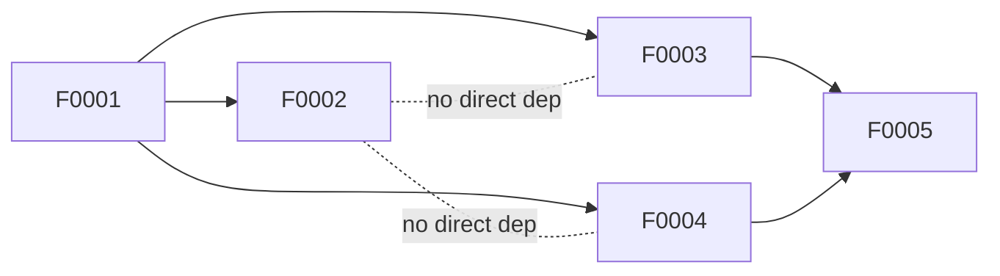

# Project Plan

**Version:** 0.2.0-draft · **Stand:** 2026-04-24

Dieser Plan ist die Eine-Seite-Sicht auf die Roadmap. Details leben in der
Spec (`docs/spec/SPECIFICATION.md`), den ADRs (`docs/decisions/`), den
Feature-Files (`docs/features/`) und den Research-Briefs (`docs/research/`).

## Zielzustand

Ein persönliches Multi-Projekt-Steuerungssystem, das Claude Code und Codex
CLI als gleichwertige Peer-Adapter nutzt, Agent-Arbeit orchestriert statt
selbst ausführt, Ausführung per `ExecutionAdapter` kapselt, Kosten per
4-Scope-Budget-Gate kontrolliert und Benchmarks als Entscheidungs-Awareness
mitführt (nicht als Auto-Dispatch-Eingabe).

## Milestones

| Stage | Arbeitstitel | Ziel | Einstiegs-Kriterium | Exit-Kriterium |
|---|---|---|---|---|
| v0 | Handbetrieb mit Schema | Vokabular gegen echte Arbeit testen | Spec + ADRs + CLI-Scaffold bereit | SQLite-Schema + `work add`/`work next` laufen, 5+ Work Items manuell durchgezogen |
| v1a | Durable Single-Loop (lokal) | Work-Item-Lifecycle automatisieren | v0 Exit erfüllt | DBOS lokal, 8-Schichten-Sandbox, Budget-Gate, HITL-Inbox, Cost-Aware-Routing-Stub aktiv |
| v1b | Read-only Bridge (VPS optional) | Messenger/Mail als Adapter | v1a Exit erfüllt, Bridge-Bedarf belegt | Bridge pollt read-only, schreibt nicht |
| v2 | Portfolio-Koordination | Multi-Project, Dependencies, Knowledge | v1 Exit erfüllt | 3 parallele Projekte, Dependencies explizit, Knowledge-Capture |
| v3 | Governance & Lernen | Standards-Promotion, Bindings | v2 Exit erfüllt | ≥ 3 bound Standards in Agent-Runs wirksam |

Stage-Details entstehen in eigenen Dateien (`docs/plans/vN-*.md`), wenn sie
Substanz haben. Bis dahin genügt diese Tabelle.

## Feature-Index (manuell gepflegt)

| ID | Titel | Stage | Status | ADR | Spec | Notiz |
|---|---|---|---|---|---|---|
| F0001 | SQLite Schema for Core Objects | v0 | proposed | ADR-0001, ADR-0003 | §5.7 | Ausgangspunkt v0 |
| F0002 | `work add` / `work next` CLI | v0 | proposed | ADR-0001 | §5.3 | Einziger v0-Einstieg |
| F0003 | Cost-Aware Routing Stub | v1a | proposed | ADR-0014 | §5.3, §8.6 | Minimal-Router, keine Kendall-τ-Mathematik |
| F0004 | Benchmark Awareness (Manual Pull) | v1a | proposed | ADR-0014 | §5.5, §8.6 | `agentctl benchmarks pull`; Awareness, kein Auto-Dispatch |
| F0005 | Benchmark-Curated Pin Refresh | v1a | proposed | ADR-0014 | §5.3, §6.2, §8.6 | Wöchentlicher HITL-Kurations-Loop; Modell-Arrival + Pin-Drift |

Weitere Features entstehen mit ADR-Implementierung:
- ADRs 0010–0013 bekommen Feature-Files, sobald die Implementierung in
  Reichweite ist (v1a).

## Abhängigkeiten (informell)

F0001 (Schema) ist Voraussetzung für alles. F0002 (CLI) ist v0-Gate.
F0003/F0004 sind v1a-Themen und können nach F0002 parallel starten.
F0005 ist der Kurations-Loop und hängt an beidem (liest Benchmarks aus
F0004, schreibt Pins aus F0003).

## Kritische Pfade

- **v0-Pfad:** F0001 → F0002 → v0-Exit.
- **v1a-Pfad:** F0001 → [F0003, F0004] → F0005 → Implementierung der
  ADRs 0010–0014 → v1a-Exit.

## Offene Entscheidungen

Diese Punkte sind im Plan als Defaults gesetzt; Nutzer kann jederzeit
anpassen.

1. **Benchmark-Quellen-Auswahl.** Default: HuggingFace Open LLM Leaderboard,
   SWE-bench Verified, LiveBench, Aider polyglot, Chatbot Arena (community
   API). Revidierbar in ADR-0014 oder Feature-File F0004.
2. **Model-Inventory-Initialbefüllung.** Default: Opus 4.7, Sonnet 4.6,
   Haiku 4.5, GPT-5.4, GPT-5 mini, Gemini 3.1 Pro. Preise aus
   `docs/research/13-cost.md`. Pflegeintervall monatlich manuell.
3. **Feature-Lifecycle 3 Zustände.** Reicht für Solo-Betrieb. Ausdehnung
   auf 4–6 Zustände, sobald Review/QA-Gate gebraucht wird.
4. **Cost-Aware-Routing-Aktivierung.** Default `pinned` (`routing-pins.yaml`
   als Lookup) in v1a. `cost-aware`-Modus (Konfidenz × Kosten) aktiviert
   sich, sobald 5+ Pins gepflegt ODER 4 Wochen Nutzung, je nachdem, was
   zuerst eintritt.

## Anti-Ziele (bewusst NICHT in diesem Plan)

- **Task-Class-Specializer** (8 Klassen, Kendall-τ, Borda) — empirisch
  nicht gerechtfertigt, siehe Plan-Appendix A in
  `Plans/option-3-ich-m-chte-serialized-oasis.md`.
- **Cross-Model-Review-Loop** — empirisch nicht gerechtfertigt.
- **Learned Router** (RouteLLM-Training) — v2-Kandidat, nicht v1.
- **Benchmark-Scheduler** (DBOS-Workflow) — manueller Pull reicht für v1.
- **Per-Stage-Plan-Dateien mit Substanz** — leere Skelette produzieren
  keinen Wert.
- **Standards-Binding-Compiler** — v3-Thema.
- **Multi-Device-Sync, Event-Broker, Compliance-Audit-Trennung,
  Approval-Delegation.**

## Erfolgsmetriken (pro Stage)

v0:
- 5+ Work Items manuell durchgezogen (Vokabular-Test).
- Median-Zeit Idee → aktiv < 3 Tage (manueller Workflow).
- Keine Schema-Migration nötig nach 2 Wochen (Vokabular hält).

v1a:
- Runaway-Vorfälle (Global-Hard-Cap erreicht) = 0/Woche.
- Kosten/Tag < $25.
- Eskalations-Rate HITL/Work Item 10–25 %.
- Worktree-Sandbox-Verletzungen = 0.

v1b:
- Bridge-Latenz (Push → Inbox-Card) < 5 Minuten.
- Keine ungewollten Writes aus Bridge (Read-Only-Invariante).

v2:
- 3 parallele Projekte aktiv, WIP ≤ 5.
- Blocked-Lag < 1 Tag.

v3:
- ≥ 3 bound Standards in Agent-Runs nachweislich wirksam.
- Override-Rate Pin < 40 % (d. h. Cost-Aware-Routing gewinnt).

## Verweise

- Plan-Dokument (inkl. empirische Belege, Appendix A):
  [`../../Plans/option-3-ich-m-chte-serialized-oasis.md`](../../Plans/option-3-ich-m-chte-serialized-oasis.md).
- Spec: [`../spec/SPECIFICATION.md`](../spec/SPECIFICATION.md).
- ADRs: [`../decisions/`](../decisions/).
- Features: [`../features/`](../features/).
- Counter-Review (2026-04-23):
  [`../reviews/2026-04-23-counter-review.md`](../reviews/2026-04-23-counter-review.md).
