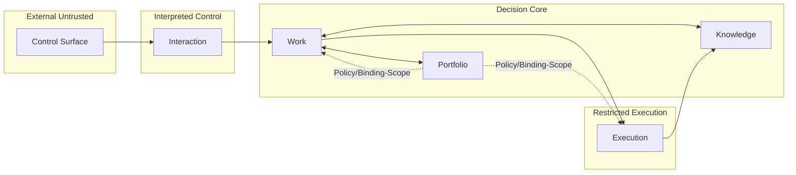

# V1-Synthese: Persönliches Agentisches Steuerungssystem

Zusammenführung der Research-Briefs 01–15 zu einer schlanken, belegten
V1-Spezifikation. Die Originaldokumente `00-11` und `REVIEW.md` im Repo-Root
sind **nicht** verbindlich — sie werden durch dieses Dokument ersetzt, sobald
es akzeptiert ist.

Jeder nicht-triviale Entwurfsschritt zitiert den Brief, der ihn stützt. Wo
Literatur schweigt, ist der Punkt als **Eigenentscheidung** markiert.

## 1 · Zielbild

Ein persönliches Multi-Projekt-Steuerungssystem für einen einzelnen Nutzer,
das agentische Arbeit (Claude Code, Codex CLI) **orchestriert, nicht selbst
ausführt**, Projekte parallel steuert, Cross-Project-Abhängigkeiten explizit
hält und Lernen in überprüfbare Standards übersetzt.

Das System ist kein Chatbot, kein Messenger-zu-CLI-Bridge, keine eigenständige
Agent-Framework-Implementierung. Es ist ein **dünner Orchestrator + Bookkeeper**
über existierenden Agent-Tools.

### Bestätigte Grundannahmen

- Single-User, Bootstrap-Projekt ist das System selbst.
- Control/Execution-Trennung als Fundament (Mainstream 2025–2026).[^B05]
- Agent-Tools (Claude Code, Codex CLI) sind aus Orchestrator-Sicht
  **stateless**.[^B01][^B02]
- Durable Workflow-Zustand lebt außerhalb des LLM.[^B03][^B05]

## 2 · Architektur im Überblick

**5 Module, 4 Trust-Zonen, keine separate Event- oder Identity-Domäne.**[^B14]

## 3 · Module

### 3.1 Interaction
Control Surface (CLI + optional Messenger/Mail), Intent-Klassifikation,
HITL-Inbox mit Cards, Escalation-Kaskade (Inbox → Push nach 4 h → Mail nach
24 h).[^B09] Single-User-Identität und Secrets leben hier als ~50-Zeilen-Teil.

**Nicht:** keine Projektzustände, keine Ausführungsanstöße ohne Workflow.

### 3.2 Work
Intake, Planning, Workflow zusammengefasst zu *einem* Work-Item-Lifecycle.
Durable-Execution-Engine (DBOS) sitzt hier. Admission-Control mit 4 Klassen
(`reject` / `defer` / `delegate` / `accept`) vor jedem Eintritt.[^B10]
WIP-Grenze: 2 aktive Work Items, 2–3 Agent-Runs pro Work Item.[^B10]

**Nicht:** keine Projektstruktur, keine Standards, keine Execution-Sandbox.

### 3.3 Execution
Bounded Agent-Runs via Claude Code (headless) oder Codex CLI (exec).
Provisioning als Property am Run. Pro Run ein Git-Worktree + Container/
Bubblewrap mit Egress-Allowlist.[^B01][^B02][^B07]

**Nicht:** keine Workflow-Steuerung, kein Projekt-Besitz, keine globale
Wahrheit aus Run-Resultaten.

### 3.4 Knowledge
Capture (Observation), Decision im ADR-Minimalformat, Standard mit
4-Stufen-Lifecycle, Artifact mit Provenance, Evidence.[^B08][^B11]
Periodischer Review-Hook alle 2–4 Wochen.

**Nicht:** keine Verbindlichkeit (Binding ist Lifecycle-State, nicht eigene
Domäne); keine Governance-Autorität; keine Workflow-Steuerung.

### 3.5 Portfolio
Project, Dependency, Binding-Scope als Properties. Policy als Querschnitt
(nicht Modul): welcher Standard gilt in welchem Project-Scope. Blocker-
Bewertung aus Dependencies.

**Nicht:** keine Historie von Runs (gehört zu Work), keine Wissens-
Bestände (gehört zu Knowledge).

### Was nicht existiert

Aus den ursprünglich 13 Kontexten der alten Notizen entfallen explizit:
`Identity, Trust & Access` (→ Single-User-Querschnitt in Interaction),
`Intent Resolution` (→ Funktion in Interaction), `Event Fabric` (→
Infrastruktur, keine Fachdomäne), `Policy & Governance` (→ Querschnitt in
Portfolio), `Project Provisioning & Provider Integration` (→ Property an Run),
`Observability & Audit` (→ betriebsquer, kein Modul; nur bei Compliance-Bedarf
separat).[^B14]

## 4 · Kernobjekte

| Objekt | Modul | Pflichtfelder (Minimum) |
|---|---|---|
| `Project` | Portfolio | id, title, state, created_at, provider_binding? |
| `Work Item` | Work | id, project_ref, title, state, priority, plan_ref? |
| `Run` | Work | id, work_item_ref, agent (`claude-code`\|`codex`), state, budget_cap, result_ref? |
| `Dependency` | Portfolio | id, source_ref, target_ref, kind, state, basis |
| `Observation` | Knowledge | id, source_ref, body, captured_at, classification? |
| `Decision` | Knowledge | id, subject_ref, context, decision, consequence, state |
| `Standard` | Knowledge | id, title, body, scope, state, applies_to? |
| `Artifact` | Knowledge | id, origin_run_ref, kind, path\|ref, provenance, state |
| `Evidence` | Knowledge | id, subject_ref, kind, source_ref, captured_at |

**9 Objekte** (vorher 12). Entfallen: `Approval` (Flag am Work Item), `Context
Bundle` (Funktion in Knowledge), `Provider Binding` (Property an Run).
Entfernt: `Evidence.trust_class` (Kategorienfehler).[^B14]

## 5 · Lifecycles

- `Project` — `idea → candidate → active → dormant → archived`
- `Work Item` — `proposed → accepted → planned → ready → in_progress → waiting/blocked → completed/abandoned`
- `Run` — `created → running → paused/waiting/retrying → completed/failed/aborted`
- `Dependency` — `proposed → established → satisfied/violated → obsolete`
- `Standard` — `candidate → accepted → bound → retired` (4 statt 6 Stufen)[^B11]
- `Artifact` — `registered → available → consumed → superseded → archived`

## 6 · Execution- und Trust-Modell

### Minimum Viable Sandbox pro Run[^B07]

1. Git-Worktree pro Run (isolierter Arbeitsbaum).
2. Container oder Bubblewrap/Seatbelt, CWD rw, Rest ro.
3. Non-Root + `--cap-drop=ALL` + `no-new-privileges`.
4. Read-Only-Root-FS + tmpfs für `/tmp`.
5. Egress-Proxy mit Domain-Allowlist (Registries, Git, Modell-Endpoint);
   Block auf 169.254.169.254.
6. Config-Write-Schutz für `.mcp.json`, `~/.ssh`, Shell-RCs, `.claude/`,
   `.codex/`.
7. cgroup-Ressourcen- und Token-Budget-Limits.
8. Secret-Injection pro Run, keine Env-Vererbung.

### Agent-Aufruf

- **Claude Code (headless):**
  `claude -p --output-format json --bare --allowedTools=<explizit>`.
  Keine interaktiven Sessions. Session-State ist aus Orchestrator-Sicht
  nicht persistent.[^B01]
- **Codex CLI (exec):**
  `codex exec --json --output-schema <file> --ephemeral`,
  `approval=never` + `sandbox=workspace-write`, Protected Paths bleiben
  ro.[^B02]
- **Pydantic AI** als dünner LLM-Call-Wrapper für alle Klassifikations-,
  Zusammenfassungs- und Strukturierungsaufgaben, die **nicht** an einen
  vollen Agent gehen.[^B04]

### Trust-Zonen (4)

1. **External Untrusted** — Eingaben via Control Surface.
2. **Interpreted Control** — Interaction-Modul.
3. **Decision Core** — Work + Portfolio + Knowledge.
4. **Restricted Execution** — Execution-Modul, sandboxed.[^B07]

## 7 · Orchestrierung und Persistenz

### Stack

- **Durable-Execution:** DBOS als In-Process-Library. Step-Checkpoints in
  derselben Transaktion wie Domänendaten — keine Dual-Write-Fehlerklasse.[^B03]
- **Primärspeicher:** SQLite WAL + Litestream → S3-kompatibles Object
  Storage. Postgres als Upgrade-Pfad, sobald zweiter Prozess oder sustained
  >50 W/s.[^B12]
- **Event-Transport:** DBOS-interne durable Queues (`send`/`recv`). Kein
  separater Bus. AD-11 („Events sind nie Business Authority") trivial
  einhaltbar.[^B03][^B12]
- **Knowledge-Speicher:** Markdown-Dateien in Git + SQLite-FTS5-Index,
  rebuildbar. Atomic Decisions und Standards als eigene Dateien pro
  Eintrag.[^B08][^B11]
- **Kein Workflow-Engine-Standalone.** Weder Temporal, Restate noch Inngest.
  Kein LangGraph, kein OpenAI Agents SDK.[^B03][^B04]

### Betriebskosten-Anker

- Lokal: 0 USD.
- VPS-Option: ~5 USD/Monat (Hetzner CX22 + Object Storage).[^B12]

## 8 · Kosten- und Eskalationsdisziplin

### Budget-Gate (Middleware vor jedem LLM-Call)[^B13]

| Scope | Default Hard-Cap | Aktion |
|---|---|---|
| Request | max_tokens + Preis-Projektion < $0,50 | sofort `reject` |
| Task (Work Item Run) | $2 **OR** 25 Turns **OR** 15 min Wall-Clock | `abort` Run |
| Projekt/Tag | soft $5 / hard $15 | `pause` → HITL-Override |
| Global/Tag | $25 hard | `suspend` System |

Optimierung mit Anthropic Prompt-Caching (stabiler Prefix) bringt
realistisch 90 % Rabatt auf gecachte Tokens; Modell-Routing Haiku für
einfache Klassifikation liefert 20–25× Ersparnis.[^B13]

### HITL-Eskalation[^B09]

- **Kriterien** (disjunktiv, V0.2.0-Korrektur via ADR-0012):
  Irreversibilität × Blast-Radius, kalibrierte Konfidenz (nicht rohe
  LLM-Confidence), erschöpfte Standardreaktionen (Clarify, Wait, Retry,
  Replan, Reject), Policy-Klasse verlangt Approval. Jede Bedingung allein
  reicht. — Frühere Synthese-Formulierung „kumulativ" war irreführend.
- **UX:** Inbox-Cards, asynchron. Push-Notifikation erst nach 4 h, Mail
  nach 24 h. Kein synchroner Push als Default.
- **Timeout-Policy (V0.2.0-Korrektur via ADR-0012):** **kein Default-Auto-
  Abandon** mehr. Nach 24 h `stale_waiting`-Flag, nach 72 h zweite Mail.
  `timed_out_rejected` nur bei harter Deadline (Auto-Reject, nie
  Auto-Approve). `abandoned` explizit oder nach 30 Tagen Inaktivität bei
  low-risk-markierten Items.
- **AD-13 präzisiert:** „Eskalation als Ausnahme" gilt für *Häufigkeit*,
  nicht *Wichtigkeit*. Irreversible High-Risk-Aktionen eskalieren immer —
  sie müssen nur selten sein.

## 9 · MVP-Staging

Ausführlich in Brief 15. Komprimiert:

- **v0 — „Handbetrieb mit Schema"** (2–4 Wochen): SQLite-Schema,
  `work add`/`work next` CLI, Agent-Runs manuell. Zweck: Vokabular testen.
- **v1 — „Durable Single-Loop"** (8–12 Wochen): DBOS, Sandbox-MVS,
  Budget-Gate, HITL-Inbox, headless Agent-Aufrufe. Zweck: Work-Lifecycle
  ohne Eingriff durchläufig.
- **v2 — „Portfolio-Koordination"** (8–10 Wochen): Multiple Projects,
  Dependencies, Admission, Knowledge-Capture. Zweck: ≥ 3 Projekte parallel.
- **v3 — „Governance & Lernen"** (8–10 Wochen): 4-Stufen-Promotion,
  Binding-Scope, Standards als `CLAUDE.md`/Skill-Artefakte.

## 10 · Erfolgsmetriken

Primär, aus SQLite + Audit-Log ableitbar (kein OTEL-Stack für V1):[^B15]

- Aktive Work Items gleichzeitig ≤ 2.[^B10]
- Aktive Projekte 3–5.
- Attention-Residue-Count (halboffene Work Items > 2 Wochen) → niedrig.
- Kosten/Tag < $25, Kosten/Work Item stabil nach 2-Wochen-Kalibrierung.
- Eskalations­rate (HITL/Work Item) 10–25 %.
- Zeit Idee → aktives Work Item (Median) < 3 Tage.
- Runaway-Vorfälle (Hard-Cap erreicht) = 0/Woche.

Anti-Metriken: erledigte Work Items/Tag, aufgenommene Ideen/Tag, „Velocity",
`bound` Standards als Quote.[^B15]

## 11 · Offene Entscheidungen

- **Control Surface:** CLI-first gesetzt; zusätzlich Telegram / Mail /
  Matrix? Nicht in den Briefs beantwortet (Tier-A-Frage offen aus
  `12-open-questions.md` #6).
- **Claude Code vs. Codex CLI vs. beide in v1?** Briefs 01 und 02 zeigen
  beide als tragfähig mit unterschiedlichen Trust-Profilen — gleichzeitiger
  Support ist zusätzliche v1-Komplexität.
- **Cloud-Varianten** (Claude Code Cloud, Codex Cloud) erst ab v2+, wenn
  überhaupt — Lokal reicht für V1.[^B01][^B02]
- **Approval als eigenständiges Objekt** zurückholen, sobald Delegation an
  andere Personen in den Scope kommt. Für V1 als Flag am Work Item
  ausreichend.
- **Multi-Device-Sync / CRDT** nur relevant, wenn Knowledge auf mehreren
  Geräten gleichzeitig editiert wird. Nicht V1.[^B12]
- **Observability / Audit als eigenes Modul** ausschließlich bei
  Compliance-Audit-Bedarf trennen. Sonst Querschnitt.

## 12 · Was bewusst *nicht* in V1 ist

- Multi-Tenant.
- Cloud-gehostetes Steuerungssystem (nur lokal/VPS).
- Multi-User-Governance.
- Federation / A2A-Protokolle.
- Dedicated Event-Broker (NATS, Kafka).
- LangGraph, OpenAI Agents SDK, Temporal, Restate, Inngest.
- Cross-Device-CRDTs.
- Formale Compliance-Zertifizierung.
- Approval-Delegation.

## 13 · Validierungslogik der Synthese

Jede Nicht-Triviale-Aussage ist an einen Brief gebunden. Quellenkette für die
fünf zentralen Design-Entscheidungen:

| Entscheidung | Belegkette |
|---|---|
| 5 statt 13 Module | Brief 06 (DDD-Skalen) + Brief 08 (PKM-Achse) + REVIEW.md |
| DBOS + SQLite + Litestream | Brief 03 + Brief 12 |
| Sandbox-MVS (8 Schichten) | Brief 07 (OWASP / NIST / NVIDIA / Anthropic / OpenAI cross-validiert) |
| Inbox statt Push für HITL | Brief 09 (Mark 2004, CDSS-Alert-Fatigue) |
| 4-Stufen-Promotion für Standards | Brief 11 (Argyris, Nygard, Ahrens, LLM-Kontext-Reset) |

### Ehrlich: was ist Erfindung?

- Das **exakte Mapping** der 12 Objekte auf 9 Objekte ist Design, nicht
  Literatur (Brief 14).
- Die **konkreten $-Caps** (0,50 / 2 / 5 / 15 / 25) sind kalibrierbare
  Startwerte, keine empirischen Konstanten.[^B13]
- Die **Timeout-Zahlen** (4 h Push, 24 h Mail, 72 h zweite Mail) sind
  Eigenentscheidung auf Basis qualitativer Brief-09-Belege. Kein Default-
  Auto-Abandon (ADR-0012, V0.2.0-Korrektur).
- Die **WIP-Zahlen** sind gestützt (Brief 10), aber konkret-parametrisiert
  durch Design.

## Quellenverweise

[^B01]: `01-claude-code.md`.
[^B02]: `02-codex-cli.md`.
[^B03]: `03-durable-execution.md`.
[^B04]: `04-agent-orchestration-libs.md`.
[^B05]: `05-agent-patterns.md`.
[^B07]: `07-trust-sandboxing.md`.
[^B08]: `08-pkm.md`.
[^B09]: `09-hitl.md`.
[^B10]: `10-work-admission.md`.
[^B11]: `11-learning.md`.
[^B12]: `12-persistence.md`.
[^B13]: `13-cost.md`.
[^B14]: `14-context-count.md`.
[^B15]: `15-mvp-metrics.md`.
