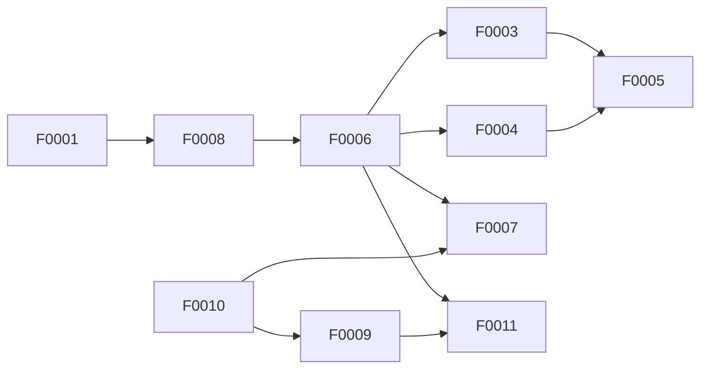

# Pre-v1a Implementation Readiness Audit

## Kontext

V0 ist implementiert (Branch `feat/v0-schema-and-cli`, drei Commits,
40/40 Tests). Bevor v1a-Implementierung beginnen kann, müssen die
v1a-relevanten ADRs (0010–0016) und die schon existierenden v1a-
Feature-Files (F0003–F0008) gegen das R1–R4-Gate aus
`~/.claude/CLAUDE.md` (Issue Clarity) auditiert werden. Außerdem listet
`docs/plans/project-plan.md` ("Open v1a-Exit Implementation Gaps") vier
ADRs ohne dediziertes Feature-File.

Dieser Audit ist die Inventur — nicht die Lückenfüllung. Lücken werden
benannt, nicht geschlossen.

## 1. ADR-Coverage-Matrix

| ADR | Titel | Feature(s) | Lücke? |
|---|---|---|---|
| 0010 | Execution Harness Contract | — | **Ja** — kein F-File für Sandbox/Egress/Secret-Injection/Exit-Vertrag |
| 0011 | Runtime Audit + Run Attempts | F0006 | Nein (alle 8 Tabellen + Reconcile-CLI gedeckt) |
| 0012 | HITL Timeout Semantics | — | **Ja** — kein F-File für ApprovalRequest-Lifecycle + Eskalation |
| 0013 | V1 Deployment Mode | — | **Ja** — kein F-File für Litestream-Restore-Drill + `needs_reconciliation`-Hook |
| 0014 | Peer Adapters + Cost-Aware Routing | F0003, F0005 | Teilweise — Adapter-Implementierungen sind Sache von ADR-0010-Feature |
| 0015 | Tool-Risk Inventory + Approval Routing | F0007 | **Ja** — Pattern-Matcher-zur-Call-Zeit hat kein F-File (Plan benennt explizit als Sub-Feature) |
| 0016 | Config Write Contract | F0005, F0007 (als Konsumenten) | Nein (wird über Konsumenten geliefert) |

Vier komplette Lücken-Features identifiziert (siehe §3).

## 2. R1–R4-Status der existierenden v1a-Features

### F0003 — Cost-Aware Routing Stub

| R | Status | Anmerkung |
|---|---|---|
| R1 testbar | ✅ | Pin-Lookup Unit-Test, Dispatch-Show Roundtrip |
| R2 Deliverable | ✅ | Dispatcher-Code vor Run-Start, klar |
| R3 single interpretation | ⚠️ | `cost-aware`-Modus dokumentierter TODO; Haiku-Confidence-Probe-Logik nicht spezifiziert (defer-OK, weil pinned ist v1a-Default) |
| R4 Scope | ✅ | pinned-Default + cost-aware-Opt-in explizit |

**Bewertung**: ready-to-implement für `pinned`-Modus; cost-aware-Modus wartet auf eigenes Folge-Feature.

### F0004 — Benchmark Awareness (Manual Pull)

| R | Status | Anmerkung |
|---|---|---|
| R1 testbar | ✅ | Source-Adapter mit Fixtures, Normalisierung |
| R2 Deliverable | ✅ | Evidence+Artifact-Linkage, kein Auto-Dispatch |
| R3 single interpretation | ❌ | **Lücke**: Benchmark-Normalisierungsschema nur ungefähr (`{source, pulled_at, model_id, task_class, metric, score}`) — Pflicht/Optional-Felder, Encoding bei Score-Tupeln (z. B. SWE-bench resolved/total), Fehlerbehandlung bei Schema-Mismatch nicht normativ |
| R4 Scope | ✅ | Awareness-Only |

**Bewertung**: nicht ready bis Normalisierungsschema in Pydantic-Contracts (oder ADR-Patch) festgehalten ist.

### F0005 — Benchmark-Curated Pin Refresh

| R | Status | Anmerkung |
|---|---|---|
| R1 testbar | ✅ | Drift-Berechnung Unit, Refresh→Review→Accept Integration |
| R2 Deliverable | ✅ | CLI-Befehle + Config-Writes über ADR-0016 |
| R3 single interpretation | ❌ | **Lücken**: (a) Drift-Schwelle Default 3 pp ist „konservativer Startwert ohne empirischen Anker" — als Eigenentscheidung markiert, OK; (b) `model-inventory.yaml.rules.adapter_assignment_rules` referenziert, aber nirgends definiert |
| R4 Scope | ✅ | Manueller HITL-Workflow, kein Auto-Dispatch |

**Bewertung**: nicht ready bis `adapter_assignment_rules`-Schema in F0004 oder F0005 oder ADR-0014 spezifiziert ist.

### F0006 — Runtime Records SQLite Schema + Reconcile CLI

| R | Status | Anmerkung |
|---|---|---|
| R1 testbar | ✅ | Migration Roundtrip, Constraint-Tests, Crash-Szenario |
| R2 Deliverable | ✅ | 8 Tabellen + Reconcile-CLI lieferbar |
| R3 single interpretation | ❌ | **Lücken**: (a) Migrations-Reihenfolge F0008 → F0006 nicht normativ ausgesprochen (FK auf `run` verlangt F0008 zuerst); (b) `tool_risk_match`-PolicyDecision wird hier definiert, aber Schreib-Timing („wann genau wird sie persistiert?") nur in F0007 implizit; (c) JSONL-Runlog-Format nur als „strukturiertes stdout der Agent-CLI" — Pflichtfelder nicht aufgezählt |
| R4 Scope | ✅ | Schema F0006-lokalisiert, Reconcile klar abgegrenzt |

**Bewertung**: nicht ready bis Migrations-Reihenfolge + JSONL-Format spezifiziert sind.

### F0007 — Tool-Risk Drift Detection

| R | Status | Anmerkung |
|---|---|---|
| R1 testbar | ✅ | Audit-Aggregation Unit, Drift-Detection, Digest-Card-Idempotenz |
| R2 Deliverable | ✅ | CLI-Befehle, kein neues DB-Schema |
| R3 single interpretation | ❌ | **Lücke**: Fallback-Re-Match für Alt-Daten nutzt eine „kleine in-process Glob-Implementierung" — Pattern-Matching-Engine (First-Match, Catch-all-Position, Glob-Syntax) ist nicht in F0007 definiert. Der Plan nennt als ungeschlossene Lücke „Tool-Risk Pattern Matcher zur Call-Zeit als eigenes F-Feature" → siehe F0010-Vorschlag in §3 |
| R4 Scope | ✅ | Drift-Detection, nicht Dispatch |

**Bewertung**: nicht ready bis F0010 (Pattern Matcher) implementiert oder Inline-Spec ergänzt ist.

### F0008 — V1 Domain Schema (Run, Artifact, Evidence)

| R | Status | Anmerkung |
|---|---|---|
| R1 testbar | ✅ | Migration auf leerer DB, FK/CHECK, Roundtrip mit F0001+F0006 |
| R2 Deliverable | ✅ | 3 Tabellen minimal, CRUD-CLIs out-of-scope |
| R3 single interpretation | ❌ | **Lücke**: Polymorphe `evidence.subject_ref` mit CHECK-Regex validiert, aber Präfix-Tabelle hardcodiert (`work_item`, `run`, `artifact`, `decision`); Erweiterungsmechanismus bei neuen Entity-Typen fehlt; Applikations-Layer-Existenzprüfung in F0006 erwähnt, aber nirgends formalisiert |
| R4 Scope | ✅ | Domain-Slice klein, klar |

**Bewertung**: nicht ready bis polymorpher-Ref-Mechanismus in F0008 oder ADR-Patch spezifiziert ist.

### Zusammenfassung Bestandsfeatures

| Feature | Ready? | Blocker |
|---|---|---|
| F0003 | ✅ (pinned-Mode) | — |
| F0004 | ❌ | Normalisierungsschema |
| F0005 | ❌ | `adapter_assignment_rules`-Schema |
| F0006 | ❌ | Migrations-Reihenfolge + JSONL-Format |
| F0007 | ❌ | Pattern-Matching-Engine (F0010-Bezug) |
| F0008 | ❌ | Polymorpher-Ref-Mechanismus |

**1 von 6 ready**. Fünf brauchen R3-Patches (analog zu dem F0001/F0002-Patch in Commit `d68fccc`).

## 3. Vorgeschlagene Lücken-Features (F0009–F0012)

### F0009 — Execution Harness: Sandbox & Secret Injection

ADR-Anker: 0010
Acceptance-Kerne:
- Container-Mount-Tabelle erzeugt Worktree-RW, System-RO, Secrets-Path
- Egress-Proxy auf Loopback mit Domain-Allowlist
- Exit-Artefakte als JSONL (`cost_receipt`, `tool_calls[]`, `artifacts_manifest`, `sandbox_violations`, `idempotency_keys`)
- Cgroup-Limits (4 GiB Memory, 2 CPU, 15 min Wall-Clock)

### F0010 — Tool-Risk Pattern Matcher (Runtime)

ADR-Anker: 0010 + 0015
Acceptance-Kerne:
- Pattern-Matching-Engine: First-Match, Catch-all-Fallback, Glob-Syntax (`gh_*`, `shell_*`)
- Fail-closed Default für nicht gelistete Tools → `high, required`
- Erzeugt `PolicyDecision(policy=tool_risk_match)` mit `matched_pattern`/`risk`/`approval`/`default_hit`-Output
- Pre-Flight-Check vor Tool-Call

### F0011 — HITL Inbox: Approval Lifecycle & Eskalation

ADR-Anker: 0012
Acceptance-Kerne:
- ApprovalRequest-Lifecycle (4 Zustände)
- Eskalations-Kaskade: Inbox-Card (t=0) → Push (t=4h, medium+) → Mail (t=24h) → Auto-Reject (Deadline)
- Digest-Card-Kanal für System-Health-Signale (`info`-Status, kein Block)
- `stale_waiting`-Flag + 30-Tage-Low-Risk-Abandon

### F0012 — Litestream Integration & Restore-Drill

ADR-Anker: 0013
Acceptance-Kerne:
- Continuous Backup zu Object-Storage (Hetzner / S3-kompatibel)
- `needs_reconciliation`-Startup-Hook nach Restore
- Quarterly-Restore-Drill als geplanter Workflow
- v1b-Optional: Read-only-Bridge-Instanz mit Latenz-Toleranz

## 4. Dependency-Reihenfolge

**Kritischer Pfad (minimale v1a-Implementierung):**
F0001 ✓ → F0008 → F0006 → [F0003 ∥ F0004 ∥ F0010] → F0009 → F0011

**Bottlenecks**:
- F0006 blockiert F0003–F0007 + F0011 (Runtime-Records-Basis)
- F0008 blockiert F0006 (FK auf `run`)
- F0010 blockiert sicheres F0009 (`approval=never` braucht Matcher)

F0012 ist **optional für v1a** (required vor v1b).

## 5. Watch-Items (außerhalb ADR-Scope)

1. **Eval-Stack-Wahl** (Phoenix vs. Logfire vs. OpenTelemetry): wird mit F0009-Implementierung akut. ADR-Kandidat.
2. **DBOS-Python-Wrapper-Klarstellung**: ADR-0017 sagt Python; DBOS-SDK-Detail (embedded vs. Client-zu-Server) nicht spezifiziert. ADR-Detail.
3. **Restore-Fail-Playbook**: F0012 nennt Restore-Drill, aber kein Playbook für partiellen Migrations-Fehler bei Restore.
4. **Benchmark-Source-Resilienz**: F0004 erlaubt Source-Fehler ohne Pull-Abbruch, aber kein Retry/Cache-Mechanismus → instabile Quelle (Rate-Limit) führt zu degenerierter F0005-Datenlage.
5. **Config-YAML-Validator-Implementierung**: ADR-0016 verweist auf ADR-0018 für Schema-Validierung, aber Validator-Code-Position + Fehler-Kette nicht spezifiziert.

## 6. Empfohlene Reihenfolge

In Reihenfolge der Wert-Pro-Aufwand-Ratio:

**Priorität 1 — R3-Patches der Bestandsfeatures** (analog Commit `d68fccc`):
- F0008 (polymorpher Ref-Mechanismus) — blockiert F0006
- F0006 (Migrations-Reihenfolge + JSONL-Format)
- F0004 (Benchmark-Normalisierungsschema)
- F0005 (`adapter_assignment_rules`-Schema)

**Priorität 2 — Lücken-Features als `proposed`-Skelette anlegen**:
- F0009, F0010, F0011, F0012 (mit R1-R4-konformen Entwürfen, nicht nur Stubs)

**Priorität 3 — Implementierungs-Reihenfolge** (nachdem alle Features ready sind):
- F0008 → F0006 → F0010 → F0003/F0004/F0007 → F0009 → F0005 → F0011

**Priorität 4 — Watch-Items als ADR-Vorlagen**:
- ADR-0021 (Eval-Stack-Wahl) und ADR-0022 (DBOS-Python-Wrapper-Klarstellung) drafts

## 7. Was dieser Audit *nicht* macht

- Schließt keine R3-Lücken (das sind eigene Patches mit ADR-Klärungen).
- Schreibt keine F0009–F0012-Skelette (das ist nächster Schritt, falls gewünscht).
- Stellt keine Implementierungs-Roadmap auf (das macht ein eigener Plan, sobald alle Features ready sind).
- Setzt nichts auf `done` (Feature-Lifecycle-Regel: nur Nutzer per Commit).
