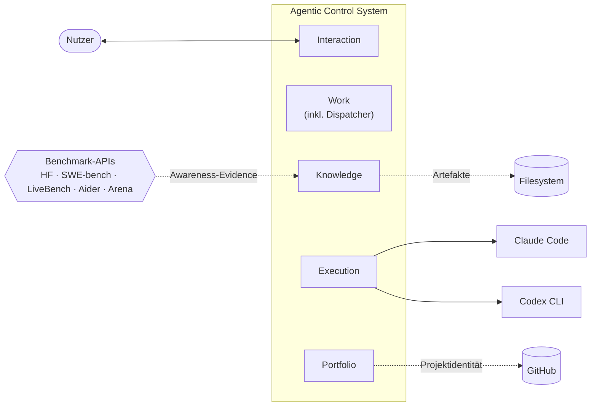
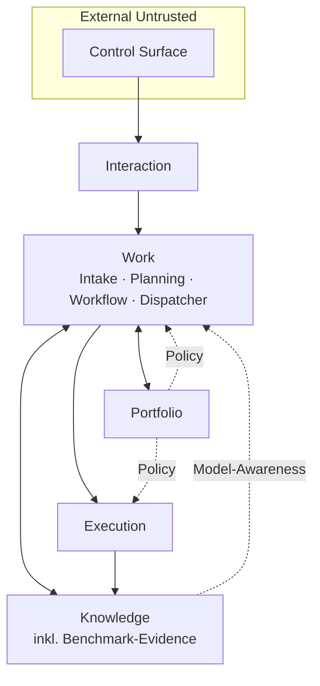

# Personal Agentic Control System — V1 Specification

Diese Spezifikation beschreibt die V1-Zielarchitektur eines persönlichen,
agenten-gestützten Multi-Projekt-Steuerungssystems. Sie folgt der arc42-Gliederung.
Jeder Abschnitt verweist auf die quellenbasierten Research-Briefs in
`docs/research/`, auf die MADR-ADRs in `docs/decisions/` und — wo einschlägig — auf
die Feature-Files in `docs/features/`.

Zielarchitektur und Release-Stages sind getrennt: die Sektionen §1–§11 beschreiben
den V1-Zielzustand; Appendix A beschreibt, welche Stufe welche Teile tatsächlich
liefert.

---

## 1 · Einführung und Ziele

### 1.1 Aufgabenstellung

Ein einzelner Nutzer betreibt parallel mehrere Projekte, stößt regelmäßig auf
neue Ideen und hat projektübergreifende Abhängigkeiten. Er möchte agentische
Arbeit (Claude Code, Codex CLI) **orchestrieren** — nicht *selbst* ausführen —,
damit Arbeit verlässlich durchläuft, Kontrollpunkte erhalten bleiben und
Lernen kontrolliert zurückfließt.

### 1.2 Qualitätsziele

1. **Beherrschbarkeit** — jede Ausführung ist durch einen expliziten Auftrag
   mit Budget, Scope und Guardrails beschränkt.
2. **Nachvollziehbarkeit** — jede Entscheidung, jedes Ergebnis hat eine Spur
   zu Auslöser, Eingaben und Artefakten.
3. **Proportionalität** — V1 kostet keine Enterprise-Infrastruktur; das System
   läuft auf einem Laptop oder einem 5-USD-VPS.
4. **Änderbarkeit** — das Datenmodell ist portierbar, keine Lock-in-Bindung an
   einen Provider oder ein Framework.
5. **Sicherheit** — Agent-Ausführung findet in einer begrenzten Sandbox mit
   Egress-Kontrolle statt.

### 1.3 Stakeholder

| Rolle | Erwartung |
|---|---|
| Primärnutzer (Einzelperson) | Entlastung, nicht Zweitjob |
| Claude Code und Codex CLI | klarer Auftrag, klare Grenzen, strukturierte Rückgabe |
| Zukünftige Integratoren (Messenger, Mail) | stabile Adapter-Grenze |

## 2 · Randbedingungen

- **Single-User-Betrieb**; keine Multi-Tenant-Anforderungen.
- **Bootstrap auf Laptop und/oder einem kleinen VPS**; kein Kubernetes.
- **Kostendeckel** explizit: maximal ~$5/Monat Infrastruktur, maximal
  $25/Tag LLM-Kosten (harter Cap).
- **Provider-neutral**, GitHub-first als naheliegende Erstumgebung.
- **Keine Abhängigkeit** von proprietären Orchestration-Diensten.
- **Deutsch** als Dokumentations- und Interaktions-Sprache.

## 3 · Kontext und Ziel-Abgrenzung

### 3.1 Fachlicher Kontext



### 3.2 Technischer Kontext

- **Eingang:** CLI, optional Messenger/Mail (V2+).
- **Ausgang:** HITL-Inbox (CLI), Status-Projektionen.
- **Execution-Schnittstellen:** Claude Code headless **und** Codex CLI exec als
  Peer-Adapter, Wahl pro Run durch den Dispatcher (ADR-0014).
- **Persistenz-Schnittstellen:** lokales Dateisystem (SQLite, Markdown,
  Git), optional Object Storage für Backup (Litestream).
- **Evidence-Eingang:** Benchmark-APIs (HuggingFace Open LLM Leaderboard,
  SWE-bench, LiveBench, Aider polyglot, Chatbot Arena) — **nur als
  Awareness-Evidence**, nicht als automatische Dispatch-Eingabe (ADR-0014,
  §8.6).

### 3.3 Out of Scope für V1

Multi-User-Delegation, Cloud-gehosteter Orchestrator, dedicated
Event-Broker (NATS, Kafka), Multi-Device-Sync mit CRDTs,
Compliance-Zertifizierung, Approval-Delegation, Task-Class-Specializer
(empirisch verworfen, siehe §11.3), Cross-Model-Review-Loop (empirisch
verworfen), Learned Router (v2-Kandidat).

## 4 · Lösungsstrategie

### 4.1 Leitentscheidungen (Übersicht, Details in ADRs)

| Dimension | Entscheidung | ADR |
|---|---|---|
| Architektur-Idiom | Modular Monolith mit 5 Modulen | ADR-0001 |
| Durable Execution | DBOS (In-Process) | ADR-0002 |
| Primärspeicher | SQLite WAL + Litestream → Object Storage | ADR-0003 |
| Agent-Aufruf | Headless Claude Code + Codex CLI exec, stateless | ADR-0004 |
| LLM-Call-Wrapper | Pydantic AI, **kein** LangGraph/Agents-SDK | ADR-0004 |
| Sandbox | 8-Schichten-MVS pro Agent-Run | ADR-0006 |
| Execution Harness Contract | Adapter-neutral, explizite Mounts/Secrets/Egress/Exit | ADR-0010 |
| Runtime Audit | RunAttempt, AuditEvent, ApprovalRequest, BudgetLedgerEntry, … | ADR-0011 |
| HITL | Inbox-Cards, 4 Zustände, disjunktive Kriterien, Digest-Card-Kanal | ADR-0007, ADR-0012 |
| HITL-Timeouts | Kein Auto-Abandon-Default; `timed_out_rejected` statt Auto-Approve | ADR-0012 |
| Deployment-Modus | v1a lokal-only / v1b read-only Bridge / v2+ Postgres | ADR-0013 |
| Peer-Adapters | Claude Code und Codex CLI gleichwertig, `ExecutionAdapter` als Kopplungspunkt | ADR-0014 |
| Task-Dispatch | Cost-Aware-Routing (Konfidenz × Kosten), Pins als Override, Benchmarks nur Awareness | ADR-0014, §8.6 |
| Budget-Gate | 4 Scopes: Request/Task/Projekt-Tag/Global-Tag; Dispatch → Gate | ADR-0008 |
| Standards-Promotion | 4 Stufen (candidate → accepted → bound → retired) | ADR-0005 |
| Doku-Pattern | AGENTS.md als Quelle, CLAUDE.md als Symlink; Features als einzelne MD | ADR-0009 |

### 4.2 Paradigma

**Control/Execution-Trennung** ist das architektonische Rückgrat (Brief 05).
Control lebt im Orchestrator-Prozess (Work + Portfolio + Knowledge).
Execution ist ephemer, sandboxed, stateless aus Orchestrator-Sicht.
Der Dispatcher ist **Policy** (Entscheidung), nicht **Execution** (Ausführung).

## 5 · Bausteinsicht

### 5.1 Whitebox: 5 Module



### 5.2 Interaction

Control Surface (CLI primär), Intent-Klassifikation, HITL-Inbox mit Cards,
Escalation-Kaskade. Single-User-Identität und Secrets als interner
~50-Zeilen-Teil. **Beschränkung:** keine Projektzustände, keine Ausführung.

Quellen: Brief 09 (HITL), Brief 07 (Identity-Querschnitt).

### 5.3 Work

Intake + Planning + Workflow + **Dispatcher** als *ein* Work-Item-Lifecycle.
Durable-Execution-Engine (DBOS). Admission-Control mit 4 Klassen.
WIP-Limit: 2 aktive Work Items, 2–3 Agent-Runs pro Work Item.

Der **Dispatcher** ist eine Sub-Komponente von Work:
- Eingabe: Work Item im Zustand `ready`.
- Verarbeitung: prüft `config/dispatch/routing-pins.yaml` (Override),
  danach Cost-Aware-Routing (Konfidenzschätzung × Tier × Adapter-Eignung).
- Ausgabe: `DispatchDecision` (Runtime Record, ADR-0011), frozen pro
  `RunAttempt`.
- Lese-Abhängigkeit auf `config/dispatch/model-inventory.yaml`.

**Beschränkung:** Dispatcher ist **Policy**, Execution ist getrennt;
keine Projektstruktur, keine Knowledge-Bindungen. Dispatcher startet keine
externen Effekte — er erzeugt nur `DispatchDecision`.

Quellen: Brief 03 (DBOS), Brief 10 (WIP), Brief 05 (Routing-Pattern),
Brief 13 (Preisanker), ADR-0014.

### 5.4 Execution

Bounded Agent-Runs via Claude Code headless **und** Codex CLI exec als
gleichwertige Peer-Adapter. Wahl pro Run durch den Dispatcher (§5.3).
Die Adapter-Kopplung erfolgt über das `ExecutionAdapter`-Interface
(ADR-0014) mit fünf Verben:

- `supports(profile) → bool`
- `prepare(run, profile) → PreparedInvocation`
- `execute(invocation) → AdapterResult`
- `cancel(invocation_id)`
- `describe() → AdapterDescriptor`

`HarnessProfile` ist neutral (Modell-Ref, Tool-Allowlist, Sandbox-Vertrag,
Context-Budget, Approval-Mode, Output-Schema, Secrets-Scope).
Adapter-spezifische Übersetzung lebt innerhalb jedes Adapters in
`translate/`-Submodulen.

Pro Run: Git-Worktree + Container/Bubblewrap mit Egress-Allowlist, Mount-
Tabelle und Exit-Artefakte nach ADR-0010.

**Beschränkung:** keine Workflow-Steuerung, keine globale Wahrheit aus
Run-Resultaten.

Quellen: Brief 01 (Claude Code), Brief 02 (Codex CLI), Brief 07 (MVS),
ADR-0010, ADR-0014.

### 5.5 Knowledge

Capture (`Observation`), ADR-Minimal-Decisions, `Standard` mit
4-Stufen-Lifecycle, `Artifact` mit Provenance, `Evidence`. Periodischer
Review-Hook alle 2–4 Wochen.

**`Evidence(kind=benchmark)`** ist ein explizites Subtyp für extern
gepullte Benchmark-Daten (HF-Leaderboard, SWE-bench, LiveBench, Aider,
Arena). Felder: `id, subject_ref (Modell-ID), kind=benchmark, source_ref,
captured_at, jsonl_blob_ref` (Rohpayload als Artifact referenziert).
Benchmark-Evidence ist **Awareness-Material**, keine Dispatch-Eingabe.
Kein `trust_class`-Attribut (bewusst im Counter-Review entfernt).

**Beschränkung:** keine Verbindlichkeit — Binding ist Lifecycle-State,
nicht eigene Autorität.

Quellen: Brief 08 (PKM), Brief 11 (Learning), ADR-0014, ADR-0011.

### 5.6 Portfolio

`Project`, `Dependency`, `Binding-Scope` als Properties. Policy ist
Querschnitt, kein Modul. Blocker-Bewertung aus Dependencies.
**Beschränkung:** keine Run-Historie (Work), keine Knowledge-Bestände.

Quellen: Brief 14 (Kontext-Schnitt).

### 5.7 Kernobjekte und Runtime Records

#### Fachliche Kernobjekte (Domain)

| Objekt | Modul | Pflichtfelder (Minimum) | Stage |
|---|---|---|---|
| `Project` | Portfolio | id, title, state, created_at, provider_binding? | v0 |
| `Work Item` | Work | id, project_ref, title, state, priority, plan_ref? | v0 |
| `Run` | Work | id, work_item_ref, agent, state, budget_cap, result_ref? | v1 |
| `Dependency` | Portfolio | id, source_ref, target_ref, kind, state, basis | v2 |
| `Observation` | Knowledge | id, source_ref, body, captured_at, classification? | v0 |
| `Decision` | Knowledge | id, subject_ref, context, decision, consequence, state, created_at | v0 |
| `Standard` | Knowledge | id, title, body, scope, state, applies_to? | v3 |
| `Artifact` | Knowledge | id, origin_run_ref, kind, path\|ref, provenance, state | v1 |
| `Evidence` | Knowledge | id, subject_ref, kind, source_ref, captured_at, jsonl_blob_ref? | v1 |

9 Objekte. Entfallen gegenüber Legacy: `Approval` (Flag am Work Item),
`Context Bundle` (Funktion in Knowledge), `Provider Binding` (Property an
Run), `Workflow` (umbenannt zu `Run`).

Die `Stage`-Spalte zeigt, in welcher Release-Stufe das Objekt aktiv wird
(siehe Appendix A). v0-Objekte sind minimal tragfähige Teilmenge.

**Spaltentypen (normativ ab V0.3.5-draft, ADR-0019):**

- Alle `id`- und `*_ref`-Felder sind UUIDv7 (RFC 9562), gespeichert als
  `TEXT(36)` in SQLite und `UUID` in Postgres (ADR-0013 v2+ Pfad).
- Alle Timestamp-Felder sind ISO-8601 UTC als `TEXT` in SQLite, `TIMESTAMP
  WITH TIME ZONE` in Postgres.
- Alle `state`-Felder sind `TEXT` mit `CHECK`-Constraint gegen den in
  §6.1 definierten Lifecycle-Enum.
- `Observation.classification` ist in v0 freier `TEXT` (kein Enum); ein
  Enum entsteht in v1, sobald genug Beobachtungs-Klassen empirisch
  identifiziert sind.

#### Runtime Records (technischer Querschnitt, ADR-0011)

Separater Layer für Nachvollziehbarkeit und Retry-Sicherheit:

| Record | Zweck | Stage |
|---|---|---|
| `RunAttempt` | Konkreter Versuch einer Run; Startzeit, Agent, Modell, Sandbox-Profil, Prompt-Hash, Exit, Kosten | v1 |
| `AuditEvent` | Zustandsänderung an Domain-Objekten | v1 |
| `ApprovalRequest` | HITL-Gate-Instanz | v1 |
| `BudgetLedgerEntry` | Kosten-Ledger pro Request/Task/Projekt-Tag/Global-Tag | v1 |
| `ToolCallRecord` | Einzelner Tool-Call mit optionalem Idempotency-Key | v1 |
| `PolicyDecision` | Entscheidung einer Policy (Admission, Dispatch, Budget-Gate-Override, HITL-Trigger, Tool-Risk-Match — Schema-Details siehe ADR-0011) | v1 |
| `SandboxViolation` | Verweigerter Egress, Config-Write, cgroup-Limit | v1 |
| `DispatchDecision` | Adapter + Modell + Begründung pro RunAttempt (frozen) | v1 |

Runtime Records sind **keine fachlichen Kernobjekte**. Sie tragen Audit-
und Retry-Semantik, haben eigenes Schema und Retention-Policy.

## 6 · Laufzeitsicht

### 6.1 Lifecycles

- `Project`: `idea → candidate → active → dormant → archived`
- `Work Item`: `proposed → accepted → planned → ready → in_progress → waiting/blocked → completed/abandoned`
  - HITL-Sub-States von `waiting/blocked` (ADR-0012): `waiting_for_approval`,
    `stale_waiting`, `timed_out_rejected`. `abandoned` nur explizit oder bei
    30-Tage-Inaktivität eines low-risk-markierten Items.
- `Run`: `created → running → paused/waiting/retrying → completed/failed/aborted`
  - Zwischenzustand `needs_reconciliation` nach Litestream-Restore, bis
    externe Effekte per Idempotency-Key (ADR-0011) abgeglichen sind (§10.4).
- `Dependency`: `proposed → established → satisfied/violated → obsolete`
- `Standard`: `candidate → accepted → bound → retired`
- `Artifact`: `registered → available → consumed → superseded → archived`
- `Decision`: `proposed → accepted → superseded | rejected`
  - MADR-konform (ADR-0019). `accepted` ist der primäre Wirk-Zustand;
    `superseded` zeigt auf eine spätere Decision, die diese ersetzt;
    `rejected` ist Terminal ohne Nachfolger. Keine Rück-Transitionen
    (forward-only).

### 6.2 Hauptflüsse

**Neuer Input → Work Item (Admission)**
1. Eingabe trifft Interaction ein.
2. Klassifikation in eine der 4 Klassen (`reject` / `defer` / `delegate` /
   `accept`).
3. Bei `accept`: Kosten-/Scope-Schätzung, Prüfung gegen WIP-Limit.
4. Work Item entsteht mit `state=proposed`, wird später zu `accepted`.

**Work Item → Dispatch → Run → Completion**
1. Work Item in `ready`.
2. **Dispatcher** (§5.3) wählt Adapter + Modell als **vorläufige**
   Auswahl:
   - Prüft `routing-pins.yaml`; wenn Match → Pin gewinnt.
   - Sonst Cost-Aware-Routing (siehe §8.6).
3. **Budget-Gate-Check** (§8.3) mit dem vorläufigen Modell:
   - Reihenfolge: Dispatch **füttert** die Cost-Projektion ins Gate,
     nicht umgekehrt.
   - Wenn Gate günstigeren Kandidaten erzwingt: zusätzlicher
     `PolicyDecision(policy=budget_gate_override)`-Record, Dispatcher
     wählt erneut.
   - Wenn harter Cap erreicht: `suspend`/`abort`, kein Run-Start.
4. **Nach Gate** wird die finale Auswahl als `DispatchDecision` (Runtime
   Record) persistiert und pro RunAttempt **gefroren**.
5. DBOS-Workflow: Pre-Flight (Budget, Sandbox, Worktree), Agent-Call via
   ausgewähltem `ExecutionAdapter`, Post-Flight (Artefakt-Registrierung,
   Observation-Capture, Runtime-Record-Persistierung).
6. Run-Resultat wird Artifact. Work Item → `completed` oder `waiting`/
   `blocked` bei Zwischenstopp.

**HITL-Eskalation (ADR-0012)**
1. Run trifft auf Gate-Bedingung (disjunktiv): irreversible/außenwirksame
   Aktion *oder* niedrige kalibrierte Konfidenz *oder* erschöpfte
   Standardreaktionen *oder* Policy-Klasse erfordert Approval.
2. `ApprovalRequest` erzeugt (Runtime Record), Work Item-Zustand
   `waiting_for_approval`, Run pausiert.
3. Kaskade: Inbox-Card; Push nach 4 h (nur Risiko ≥ medium); Mail nach 24 h
   + `stale_waiting`-Flag. **Kein Auto-Abandon** per Default.
4. Bei harter Deadline: `timed_out_rejected` (Auto-Reject, **nie**
   Auto-Approve).
5. Nur bei explizit low-risk-markierten Items wird nach 30 Tagen Inaktivität
   `abandoned` gesetzt.

**Benchmark-Awareness-Pull**
1. `agentctl benchmarks pull` manuell oder geplant (v1: manuell).
2. Puller zieht JSON aus konfigurierten Quellen.
3. Normalisierung → `Evidence(kind=benchmark)` in Knowledge.
4. Ergebnis ist sichtbar via `agentctl benchmarks show` — **ändert keine
   Dispatch-Policy automatisch**.

**Benchmark-Refresh → Pin-Kuration (F0005, wöchentlicher HITL-Batch)**
1. Nutzer (oder Scheduler in v1.x) ruft `agentctl benchmarks refresh`.
2. Aktuelle Benchmark-Daten werden ausgewertet (Stale-Warnung > 14 Tage).
3. **Modell-Arrival-Detection:** neue `model_id` in Benchmarks, die nicht
   in `model-inventory.yaml` steht → `candidate_new_model`-Proposal.
4. **Pin-Drift-Detection:** für jeden Pin in `routing-pins.yaml`
   Vergleich gegen Top-Modell der zugeordneten Task-Klasse (Mapping:
   `config/dispatch/benchmark-task-mapping.yaml`); Delta ≥ Schwelle
   (Default 3 pp) → `candidate_pin_change`-Proposal.
5. Proposals landen in `config/dispatch/pending-proposals.yaml`
   (Append-only, 14-Tage-Expiry).
6. Nutzer läuft `agentctl dispatch review`, akzeptiert via `accept` oder
   lehnt via `reject`. **Keine automatische Anwendung** — bleibt HITL.
7. Akzeptierte Proposals modifizieren `routing-pins.yaml` bzw.
   `model-inventory.yaml` mit `AuditEvent`-Eintrag (ADR-0011).

Dieser Flow ist **kein** Runtime-Auto-Dispatch. Er ist ein kalter
Batch-Pfad, der Pins offline gegen aktuelle Benchmarks neu abgleicht.
Runtime-Dispatch liest nur die gepflegten `routing-pins.yaml` (§8.6).

**Digest-Card (ADR-0012)**
Low-Risk-System-Health-Signale (Benchmark-Drift, Cost-Trend, Sandbox-
Violations-Trend) erzeugen eine `info`-Card in der Inbox, blockieren kein
Work Item, eskalieren nicht, verfallen nach 14 Tagen.

## 7 · Verteilungssicht

V1 unterstützt drei Deployment-Modi (ADR-0013):

### 7.1 v1a — Lokal-only

- Ein Prozess, SQLite WAL + Litestream → Object Storage (Hetzner/S3).
- DBOS in-process. Keine zweite Schreibrolle.
- Claude Code + Codex CLI als lokale Subprozesse.
- Control Surface: CLI (`agentctl`).
- Backup: Litestream continuous. Restore-Drill quartalsweise (§10),
  inkl. Test-Boot des Daemons auf frischem System (ADR-0017
  Risk-Mitigation).
- **Implementierung:** Python ≥ 3.13 mit `uv` als Paketmanager
  (ADR-0017). DBOS via `dbos-py`, LLM-Wrapper via Pydantic AI
  (ADR-0004), Daten-Verträge als Pydantic-Models mit JSON-Schema-
  Export (ADR-0018).
- **Dies ist der Default für v1.**

### 7.2 v1b — Lokal + read-only Bridge (optional)

- v1a + zusätzliche Prozess-Instanz (lokal oder Hetzner CX22 ~5 USD/Monat).
- Zweit-Instanz ist **strikt read-only**: liest aus Litestream-Restore.
- Nur sinnvoll, wenn Messenger/Mail-Adapter Inbox-Cards ausliefern soll,
  ohne selbst zu schreiben.
- Schreibt der Nutzer via Messenger, wandert die Antwort **lokal** in die
  primäre SQLite — nie von der Bridge aus.

### 7.3 v2+ — Postgres

- Ausgelöst durch einen zweiten *schreibenden* Prozess oder Host, nicht
  durch Datenvolumen.
- Trigger: Messenger-Bridge mit Write-Bedarf; paralleler Agent-Host;
  sustained Writes > 50/s.
- Migration: einmaliger Import aus SQLite. DBOS-Schema portabel.

Quellen: Brief 12 (Persistence), ADR-0003, ADR-0013.

## 8 · Querschnittliche Konzepte

### 8.1 Trust-Zonen (4)

1. **External Untrusted** — Eingaben via Control Surface.
2. **Interpreted Control** — Interaction-Modul.
3. **Decision Core** — Work + Portfolio + Knowledge.
4. **Restricted Execution** — Execution-Modul, sandboxed.

### 8.2 Minimum Viable Sandbox (pro Run)

Acht Schichten, operationaler Vertrag in ADR-0010:

1. Git-Worktree pro Run.
2. Container oder Bubblewrap/Seatbelt, CWD rw, Rest ro.
3. Non-Root + `--cap-drop=ALL` + `no-new-privileges`.
4. Read-Only-Root-FS + tmpfs für `/tmp`.
5. Egress-Proxy mit Domain-Allowlist; Block auf 169.254.169.254.
6. Config-Write-Schutz für `.mcp.json`, `~/.ssh`, Shell-RCs, `.claude/`, `.codex/`.
7. cgroup-Ressourcen- und Token-Budget-Limits.
8. Secret-Injection pro Run, keine Env-Vererbung.

Cross-validiert durch OWASP / NIST / Anthropic / OpenAI / NVIDIA (Brief 07).
Vollständiger Vertrag (Mount-Tabelle, Netzwerk-Policy, Exit-Artefakte) in
**ADR-0010 (Execution Harness Contract)**.

### 8.3 Budget-Gate (Middleware vor LLM-Call)

| Scope | Hard-Cap | Aktion |
|---|---|---|
| Request | max_tokens + Preis-Projektion < $0,50 | sofort `reject` |
| Task (Run) | $2 **oder** 25 Turns **oder** 15 min | `abort` Run |
| Projekt/Tag | soft $5 / hard $15 | `pause` → HITL |
| Global/Tag | $25 hard | `suspend` System |

**Caps sind unabhängige harte Bedingungen (OR, nicht AND).** Jede für sich
bricht ab — Counter-Review Befund 5.

**Reihenfolge:** Der Dispatcher (§8.6) wählt zuerst Adapter + Modell und
füttert die Pre-Cost-Projektion ins Gate. Das Gate kann den Dispatcher
zwingen, einen günstigeren Kandidaten zu wählen (Gate rückwärts zum
Dispatcher, nicht umgekehrt). Eine solche Rewahl erscheint als
`PolicyDecision(policy=budget_gate_override)` (ADR-0011) und wird
**nicht** als zweite `DispatchDecision` modelliert — die DispatchDecision
ist immer der **post-gate-finale** Record.

Optimierung: Anthropic Prompt-Caching (stabiler Prefix); Cache-gelesene
Tokens zählen nicht gegen ITPM.

### 8.4 Observability

V1 hat **kein** OTEL-Stack. Primärmetriken (§10) sind aus SQLite und
JSONL-Logs ableitbar. Normatives Minimum:

- **SQLite-Audit-Tabellen** für Domain-Zustandsänderungen (ADR-0011,
  `AuditEvent`).
- **JSONL-Runlog** pro RunAttempt (stdout der Agent-CLI, strukturiert).
- **JSONL-Budgetledger** pro Tag (Aggregation der `BudgetLedgerEntry`-Rows).
- **CLI-Commands**: `agentctl status`, `agentctl costs today`,
  `agentctl runs inspect <id>`, `agentctl inbox`, `agentctl benchmarks show`.
- **Retention**: 90 Tage lokal, danach Archivierung oder Löschung nach
  Nutzer-Entscheidung.

### 8.5 Agent-Aufruf-Disziplin (Peer-Adapter)

Beide Adapter werden in gleicher Tiefe **vertraglich dokumentiert**;
die tatsächliche Default-Nutzung im `pinned`-Mode folgt §8.6 und der
konfigurierbaren `model-inventory.yaml.rules.defaults.adapter` (V1-
Vorschlag `claude-code`, ADR-0014):

- **Claude Code headless:**
  ```
  claude -p --output-format json --bare \
    --allowedTools=<derived> --model=<derived>
  ```
  Subagents, Skills, MCP nur wenn `AdapterDescriptor.supports_*` es
  anzeigt und der `HarnessProfile` es erlaubt.

- **Codex CLI exec:**
  ```
  codex exec --json --output-schema <file> --ephemeral \
    --approval=never --sandbox=workspace-write
  ```
  Protected Paths bleiben `ro` (ADR-0010).

- **Pydantic AI** für alle nicht-Agent-LLM-Aufrufe (Intake-Klassifikation,
  Confidence-Schätzung im Dispatcher, Summarization).

Adapter-spezifische Harness-Details leben in eigenen ADRs (geplant:
0017 Claude-Code-Harness-Profile, 0018 Codex-CLI-Harness-Profile —
anzulegen, sobald Implementierung beginnt; ADR-0016 ist bereits an den
Config-Write-Vertrag vergeben).

### 8.6 Agent-Auswahl (Task-Dispatch)

Der Dispatcher (§5.3) wählt pro Work Item Adapter + Modell. **Grundprinzip:
Cost-Aware-Routing (RouteLLM-Stil), nicht Task-Class-Specialization.**

**Empirische Basis** (Plan-Appendix A, Brief 13):
- Frontier-Modelle liegen außerhalb Coding < 2 pp auseinander (Rauschen);
  nur Coding hat 7,6 pp Delta (Claude Opus 4.7 > GPT-5.4 in SWE-bench).
- Harness-Varianz ±16 pp überwiegt Modell-Varianz.
- Cross-Model-Review leidet an Self-Preference- und Position-Bias.
- Self-MoA schlägt Mixed-MoA um 6,6 %.
- Cost-Aware-Routing (RouteLLM): 85 % Kostenreduktion bei 95 %
  Qualitätserhalt.

**Policy:**

1. `routing-pins.yaml` (manuelle Overrides) wird zuerst konsultiert.
   Match → Adapter + Modell aus Pin (vorläufig).
2. Kein Pin-Match und Mode = `pinned` (V1-Default, dauerhaft tragbar):
   `model-inventory.yaml.rules.defaults.adapter` und das passende
   `defaults[<adapter-name>]`-Modell — Default-Adapter ist
   konfigurierbar (V1-Vorschlag `claude-code`, ohne ADR-Edit
   umstellbar; ADR-0014).
3. Kein Pin-Match und Mode = `cost-aware` (explizites Nutzer-Opt-in
   via `agentctl dispatch mode cost-aware`):
   a. Confidence-Probe via Haiku.
   b. High Confidence → cheap-tier Default.
   c. Mid Confidence → standard-tier.
   d. Low Confidence → premium-tier (mit Budget-Gate-Check).
   e. Adapter-Wahl im Tier (Heuristik, kein Hardcode): Coding-Work-Items
      → Default-Adapter aus Inventory (V1: claude-code, 7,6-pp-Delta);
      sonst günstigerer Adapter im Tier.
4. Budget-Gate-Check: kann den Dispatcher zwingen, einen günstigeren
   Kandidaten zu wählen. Gate-induzierte Rewahl wird als
   `PolicyDecision(policy=budget_gate_override)` persistiert (ADR-0011),
   nicht als zweite DispatchDecision.
5. **Erst nach erfolgreichem Gate-Check** wird die `DispatchDecision`
   pro RunAttempt **gefroren**. Vor-Gate-Auswahl ist immer vorläufig.

**`DispatchDecision`** wird als Runtime Record (ADR-0011) persistiert.
Sie ist der **post-gate-finale** Record pro RunAttempt — eine
Vor-Gate-Auswahl ist immer vorläufig, eine Gate-induzierte Rewahl
erscheint zusätzlich als `PolicyDecision(policy=budget_gate_override)`.
Retries nutzen die gefrorene Entscheidung, es sei denn, HITL greift.

**Mode-Aktivierung:** Wechsel zwischen `pinned` und `cost-aware` ist
**explizit** (`agentctl dispatch mode <pinned|cost-aware>`); kein
automatischer Wechsel auf Basis von Pin-Anzahl oder Zeitintervall
(ADR-0014).

**Anti-Patterns (bewusst NICHT):**
- Task-Class-Specializer mit fester Mapping-Taxonomie (Task → Modell).
- Cross-Model-Review-Loops.
- Learned Router (v2-Kandidat).
- Kendall-τ-Disagreement-Detection oder Borda-Rank-Composite.

**Benchmarks** werden als `Evidence(kind=benchmark)` geführt (§5.5, §6.2
„Benchmark-Awareness-Pull"). Sie informieren den Nutzer, sie ändern keine
Dispatch-Policy automatisch.

## 9 · Architekturentscheidungen

Einstiegs-Index der MADRs in [`../decisions/`](../decisions/):

| Nummer | Titel | Status |
|---|---|---|
| 0001 | 5 Module, nicht 13 Kontexte | accepted |
| 0002 | DBOS als Durable-Execution-Engine | accepted |
| 0003 | SQLite + Litestream, Postgres als Upgrade-Pfad | accepted |
| 0004 | Headless Agent-Aufrufe + Pydantic AI als LLM-Wrapper | accepted (amendmented by ADR-0014) |
| 0005 | 4-Stufen-Standards-Promotion | accepted |
| 0006 | 8-Schichten-Sandbox-MVS | accepted (Follow-up in ADR-0010) |
| 0007 | HITL per Inbox-Kaskade, nicht Push | accepted (präzisiert durch ADR-0012) |
| 0008 | 4-Scope-Budget-Gate | accepted (Task-Row in V0.2.1-draft korrigiert: OR statt AND) |
| 0009 | AGENTS.md als Quelle, CLAUDE.md als Symlink | accepted |
| 0010 | Execution Harness Contract | accepted |
| 0011 | Runtime Audit and Run Attempts | accepted |
| 0012 | HITL Timeout Semantics | accepted |
| 0013 | V1 Deployment Mode | accepted |
| 0014 | Peer Adapters and Cost-Aware Routing | accepted (amends ADR-0004; cost-aware-Auto-Aktivierung in V0.2.3-draft gestrichen) |
| 0015 | Tool-Risk-Inventory and Approval Routing | accepted (V0.3.0-draft `shell_*`-Splitting) |
| 0016 | Config Write Contract for Dispatch and Execution | accepted |
| 0017 | Implementation Language for v0/v1a | accepted (Python ≥ 3.13 mit `uv`) |
| 0018 | Schema-First with JSON Schema for Data Boundaries | accepted (Pydantic-first, JSON Schema als Export-Artefakt) |
| 0019 | Primary-Key-Strategie für Domain-Tabellen | accepted (UUIDv7, `uuid-utils`-Backport bis Python 3.14) |
| 0020 | Migrations-Tool für SQLite-Schema | accepted (Alembic, ohne `--autogenerate`) |

## 10 · Qualitätsanforderungen

### 10.1 Primärmetriken

| Metrik | Zielrichtung | Basis |
|---|---|---|
| Aktive Work Items | ≤ 2 gleichzeitig | Brief 10 (Sweller) |
| Aktive Projekte | 3–5 | Brief 10 (Personal Kanban) |
| Attention-Residue | niedrig, trendet ↓ | Brief 10 (Leroy 2009) |
| Kosten/Tag | < $25 hard | Brief 13 |
| Kosten/Work Item | stabil nach Kalibrierung | Brief 13 |
| Eskalations­rate (HITL/Work Item) | 10–25 % | Brief 09 |
| Zeit Idee → aktiv (Median) | < 3 Tage | eigener Anker |
| Runaway-Vorfälle | 0/Woche | Brief 13 |
| Benchmark-Freshness | keine Quelle älter als 60 Tage | ADR-0014 |
| Dispatch-Override-Rate (Pin > Routing) | < 40 % nach Stabilisierung | ADR-0014 |
| Adapter-Mix (CC-Share) | Kennzahl, keine Zielvorgabe | ADR-0014 |

### 10.2 Sekundärmetriken

- Prompt-Cache-Hit-Rate Claude Code ≥ 60 %.
- Verhältnis Haiku : Sonnet : Opus — wenn Opus > 30 %, prüfen.
- `Standard`-Bindings angewandt/Woche > 0 (ab v3).
- Sandbox-Verletzungen (Denied-Egress, Config-Write): dokumentieren, nie
  zulassen.
- Confidence-Probe-Nutzung: Verteilung der Haiku-Confidence-Scores; wenn
  flat (immer 0.5–0.7), Probe ist nutzlos.

### 10.3 Anti-Metriken

Nicht optimieren: erledigte Work Items/Tag, aufgenommene Ideen/Tag,
„Velocity", `bound` Standards als Quote.

### 10.4 Akzeptanzkriterien (Testmatrix)

Wird pro Release-Stage erfüllt (siehe Appendix A). Minimum pro v1-Release:

- Unit: Policy- und Budget-Entscheidungen.
- Integration: Worktree-Isolation, Egress-Blocking.
- Crash nach Agent-Call vor Post-Flight, drei Effektklassen aus
  ADR-0011 separat geprüft:
  - **natürlich-idempotent** (Git-Commit, File-Write innerhalb
    Worktree): Wiederholung erzeugt identischen Inhalts-Hash → System
    erkennt Duplikat trivial, keine Duplikate möglich.
  - **provider-keyed** (z. B. GitHub-PR-Create mit
    `Idempotency-Key`-Header, sofern Provider unterstützt): Provider
    dedupliziert; Retry mit demselben Key ist sicher.
  - **lokal-only** (GitHub-Issue-Comment, Slack-Post, Mail-Send):
    Run wechselt nach Restore in `needs_reconciliation`; manueller
    Abgleich via `agentctl runs reconcile <run-id>` bestätigt jeden
    nicht persistierten Effekt einzeln (drei Optionen je Effekt:
    erfolgt / unsicher / nicht erfolgt).
- Retry innerhalb desselben Run-Lifecycles: externer Effekt wird über
  `ToolCallRecord.idempotency_key` nicht doppelt registriert (alle drei
  Klassen).
- HITL: Approval bleibt über Restart erhalten.
- Restore: Litestream-Recovery auf frischem Host, nach Restore sind
  laufende Runs als `needs_reconciliation` markiert.
- Restore-Drill: quartalsweise manuell, dokumentiertes Ergebnis.

## 11 · Risiken und technische Schulden

### 11.1 Bekannte Risiken

- **Claude-Code-Session-State** ist dokumentiert unzuverlässig
  (GitHub Issue #43696). Mitigation: aus Orchestrator-Sicht stateless
  modelliert (Brief 01).
- **Sandbox-Bypass-Klasse** via Pfad-Tricks / Token-Budget / `.claude/`-RCE
  (CVE-2025-59536 u. a.). Mitigation: nie auf Native-Sandbox allein
  verlassen — Worktree + Container zwingend (ADR-0010).
- **DBOS + SQLite in Produktion** ist offiziell nicht voll dokumentiert.
  Mitigation: Upgrade-Pfad zu Postgres im Design vorgesehen (ADR-0003,
  ADR-0013).
- **Kosten-Runaway** ist bei agentischen Loops realistisch ($300/Tag
  dokumentiert). Mitigation: 4-Scope-Gate als Middleware (ADR-0008).
- **Router-Collapse** — scalar-trained Router drifting zu teurem Modell.
  Mitigation: V1 nutzt keinen learned Router; Cost-Aware-Routing ist
  regelbasiert mit Budget-Gate-Tie-Break (ADR-0014).
- **Benchmark-Disagreement** — SWE-bench Verified vs. SWE-bench Pro können
  40 pp auseinanderliegen. Mitigation: Benchmarks sind Awareness, kein
  Auto-Dispatch (§8.6).
- **Classifier-Drift** — Haiku-Confidence-Probe kann sich verhalten, ohne
  dass ein Benchmark das reflektiert. Mitigation: Confidence-Score-
  Verteilung als Sekundärmetrik (§10.2).

### 11.2 Technische Schulden (absichtlich akzeptiert)

- **Keine Hooks** in `.claude/settings.json` für V1 (RCE-Risiko).
- **Keine Multi-Device-Sync** — Git allein reicht nur bei linearem Editieren
  auf einem Gerät.
- **Keine Observability-/Audit-Trennung** — nur bei Compliance-Bedarf.
- **Keine Approval-Delegation** — nur bei Multi-User-Scope.
- **Keine Benchmark-Scheduler-DBOS-Workflow** — manuelles Pullen in V1
  (F0004).
- **Kein Task-Class-Specializer, kein Cross-Model-Review** — empirisch
  verworfen (§8.6, Plan-Appendix A).

### 11.3 Offene Entscheidungen

- Control Surface: CLI-first gesetzt; Telegram / Mail / Matrix offen.
- Claude Code und Codex CLI als Peers ist **entschieden** (ADR-0014);
  Task-Class-Specializer und Cross-Model-Review sind **empirisch geprüft und
  für V1 verworfen**, Evidenz in Plan-Appendix A.
- Cloud-Varianten (Claude Code Cloud, Codex Cloud) erst ab v2+.
- Learned Router (RouteLLM-Training) als v2-Kandidat, nicht V1.

## 12 · Glossar

Siehe [`../../GLOSSARY.md`](../../GLOSSARY.md) im Repo-Root.

---

## Anhang A · Zielarchitektur vs. Release-Stages

Die Sektionen §1–§11 beschreiben die **V1-Zielarchitektur**. Nicht jeder
Teil ist gleichzeitig verfügbar.

### Release-Stages (siehe `docs/plans/project-plan.md`)

**v0 — „Handbetrieb mit Schema"** (2–4 Wochen)
- Was drin: Kernobjekte `Project`, `Work Item`, `Observation`, `Decision`
  (je mit `v0`-Stage in §5.7). SQLite-Schema, `work add`/`work next` CLI.
- Was nicht drin: Dispatcher, Benchmarks, Runtime Records, Sandbox.
- Zweck: Vokabular gegen echte Arbeit testen.
- Feature-Files: F0001, F0002.

**v1a — „Durable Single-Loop lokal"** (8–12 Wochen)
- Was drin: `Run`, `Artifact`, `Evidence` als Objekte. DBOS durable, MVS-
  Sandbox (ADR-0010), Budget-Gate (ADR-0008), HITL-Inbox (ADR-0012), Peer-
  Adapter-Dispatch im **`pinned`**-Modus (ADR-0014), Config-Write-Vertrag
  (ADR-0016), manueller Benchmark-Pull (F0004), Pin-Kuration (F0005),
  Tool-Risk-Drift-Detection (F0007).
- Was nicht drin: Portfolio-Dependencies, Standards-Promotion, Cloud.
- Zweck: Work-Lifecycle automatisieren.
- Feature-Files: **F0008** (V1-Domain-Schema), **F0006** (Runtime-
  Records + Reconcile-CLI), F0003 (Routing-Stub), F0004 (Benchmark-
  Awareness), F0007 (Tool-Risk-Drift), F0005 (Pin-Refresh) — plus
  später hinzukommende Feature-Files für ADRs 0010–0013 (Execution-
  Harness inkl. Pattern-Matcher).
- Reihenfolge: F0001 → F0008 → F0006 → [F0003, F0004, F0007] → F0005.

**v1b — „Read-only Messenger-Bridge"** (optional)
- Was drin: zweiter Prozess read-only.
- Was nicht drin: schreibende Bridge → das ist v2+.
- Feature-Files: noch keine.

**v1 → „cost-aware"-Mode-Aktivierung**
- Auslöser: **explizites Nutzer-Opt-in** via `agentctl dispatch mode
  cost-aware`. Kein automatischer Wechsel auf Basis von Pin-Anzahl
  oder Zeit (V0.2.3-draft, ADR-0014).
- Effekt: Dispatcher nutzt Confidence-Probe + Tier-Routing statt Defaults.
- Optional dauerhaft: `pinned`-Mode mit F0005-Kuration ist eine
  legitime Endstufe, kein Pflicht-Upgrade-Pfad zu `cost-aware`.

**v2 — „Portfolio-Koordination"** (8–10 Wochen)
- Was drin: `Dependency`, Knowledge-Review-Hook, Benchmark-Scheduler,
  eventuell schreibende Messenger-Bridge (Postgres-Pflicht, ADR-0013).
- Zweck: mehrere Projekte parallel.

**v3 — „Governance & Lernen"** (8–10 Wochen)
- Was drin: `Standard` mit Promotion-Pipeline, Binding-Scope, Bindings
  wirksam in Agent-Runs.
- Zweck: stille Standards-Erosion verhindern.

### Objekt-Stage-Mapping

Siehe `Stage`-Spalte in §5.7 (Kernobjekte) und Runtime-Records-Tabelle.
Ein Objekt ist aktiv, wenn seine Stage ≤ aktuelle Release-Stage ist.

## Anhang B · Quellenverweise

Alle nicht-trivialen Aussagen sind auf die Research-Briefs in
`docs/research/` zurückführbar. Die Brief-Nummerierung folgt dem
Recherche-Pfad (Tier A/B/C/D/E).

Die empirische Basis für die Option-3-Design-Entscheidungen (Peer-Adapter,
Cost-Aware-Routing, Verwerfung von Task-Class-Specializer und Cross-Model-
Review) ist in **Plan-Appendix A** dokumentiert:
[`../../Plans/option-3-ich-m-chte-serialized-oasis.md`](../../Plans/option-3-ich-m-chte-serialized-oasis.md).

Dokumentationsstruktur folgt arc42 v8.2 (Brief 16), ergänzt durch MADR für
Architekturentscheidungen, Feature-Files in `docs/features/` für
lieferbare Slices und Diataxis-Linse für Nutzer-Navigation.
