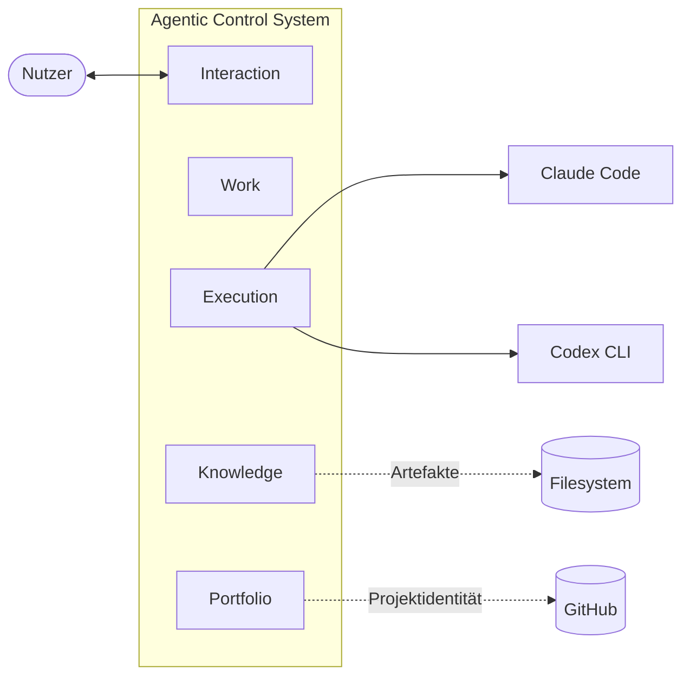
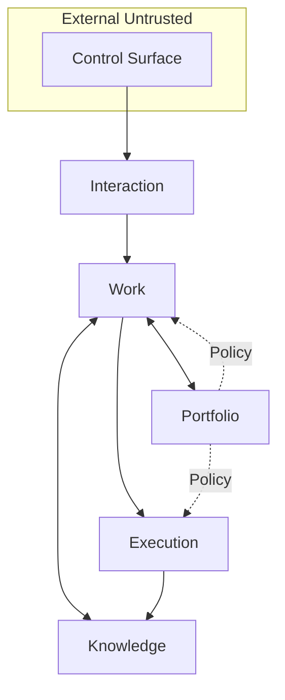

# Personal Agentic Control System — V1 Specification

Diese Spezifikation beschreibt die V1-Zielarchitektur eines persönlichen,
agenten-gestützten Multi-Projekt-Steuerungssystems. Sie folgt der arc42-Gliederung.
Jeder Abschnitt verweist auf die quellenbasierten Research-Briefs in
`docs/research/` und auf die MADR-ADRs in `docs/decisions/`.

---

## 1 · Einführung und Ziele

### 1.1 Aufgabenstellung

Ein einzelner Nutzer betreibt parallel mehrere Projekte, stößt regelmäßig auf
neue Ideen und hat projektübergreifende Abhängigkeiten. Er möchte agentische
Arbeit (Claude Code, Codex CLI) **orchestrieren** — nicht *selbst* ausführen —,
damit Arbeit verlässlich durchläuft, Kontrollpunkte erhalten bleiben und
Lernen kontrolliert zurückfließt.

### 1.2 Qualitätsziele

1. **Beherrschbarkeit** — jede Ausführung ist durch einen expliziten Auftrag
   mit Budget, Scope und Guardrails beschränkt.
2. **Nachvollziehbarkeit** — jede Entscheidung, jedes Ergebnis hat eine Spur
   zu Auslöser, Eingaben und Artefakten.
3. **Proportionalität** — V1 kostet keine Enterprise-Infrastruktur; das System
   läuft auf einem Laptop oder einem 5-USD-VPS.
4. **Änderbarkeit** — das Datenmodell ist portierbar, keine Lock-in-Bindung an
   einen Provider oder ein Framework.
5. **Sicherheit** — Agent-Ausführung findet in einer begrenzten Sandbox mit
   Egress-Kontrolle statt.

### 1.3 Stakeholder

| Rolle | Erwartung |
|---|---|
| Primärnutzer (Einzelperson) | Entlastung, nicht Zweitjob |
| Claude Code / Codex CLI | klarer Auftrag, klare Grenzen, strukturierte Rückgabe |
| Zukünftige Integratoren (Messenger, Mail) | stabile Adapter-Grenze |

## 2 · Randbedingungen

- **Single-User-Betrieb**; keine Multi-Tenant-Anforderungen.
- **Bootstrap auf Laptop und/oder einem kleinen VPS**; kein Kubernetes.
- **Kostendeckel** explizit: maximal ~$5/Monat Infrastruktur, maximal
  $25/Tag LLM-Kosten (harter Cap).
- **Provider-neutral**, GitHub-first als naheliegende Erstumgebung.
- **Keine Abhängigkeit** von proprietären Orchestration-Diensten.
- **Deutsch** als Dokumentations- und Interaktions-Sprache.

## 3 · Kontext und Ziel-Abgrenzung

### 3.1 Fachlicher Kontext

### 3.2 Technischer Kontext

- **Eingang:** CLI, optional Messenger/Mail (V2+).
- **Ausgang:** HITL-Inbox (CLI), Status-Projektionen.
- **Execution-Schnittstellen:** Claude Code headless, Codex CLI exec.
- **Persistenz-Schnittstellen:** lokales Dateisystem (SQLite, Markdown,
  Git), optional Object Storage für Backup (Litestream).

### 3.3 Out of Scope für V1

Multi-User-Delegation, Cloud-gehosteter Orchestrator, dedicated
Event-Broker (NATS, Kafka), Multi-Device-Sync mit CRDTs,
Compliance-Zertifizierung, Approval-Delegation.

## 4 · Lösungsstrategie

### 4.1 Leitentscheidungen (Übersicht, Details in ADRs)

| Dimension | Entscheidung | ADR |
|---|---|---|
| Architektur-Idiom | Modular Monolith mit 5 Modulen | ADR-0001 |
| Durable Execution | DBOS (In-Process) | ADR-0002 |
| Primärspeicher | SQLite WAL + Litestream → Object Storage | ADR-0003 |
| Agent-Aufruf | Headless Claude Code + Codex CLI exec, stateless | ADR-0004 |
| LLM-Call-Wrapper | Pydantic AI, **kein** LangGraph/Agents-SDK | ADR-0004 |
| Sandbox | 8-Schichten-MVS pro Agent-Run | ADR-0006 |
| HITL | Inbox-Cards, Push-Kaskade 4h/24h, Abandon 72h | ADR-0007 |
| Budget-Gate | 4 Scopes: Request/Task/Projekt-Tag/Global-Tag | ADR-0008 |
| Standards-Promotion | 4 Stufen (candidate → accepted → bound → retired) | ADR-0005 |

### 4.2 Paradigma

**Control/Execution-Trennung** ist das architektonische Rückgrat (Brief 05).
Control lebt im Orchestrator-Prozess (Work + Portfolio + Knowledge).
Execution ist ephemer, sandboxed, stateless aus Orchestrator-Sicht.

## 5 · Bausteinsicht

### 5.1 Whitebox: 5 Module

### 5.2 Interaction

Control Surface (CLI primär), Intent-Klassifikation, HITL-Inbox mit Cards,
Escalation-Kaskade. Single-User-Identität und Secrets als interner
~50-Zeilen-Teil. **Beschränkung:** keine Projektzustände, keine Ausführung.

Quellen: Brief 09 (HITL), Brief 07 (Identity-Querschnitt).

### 5.3 Work

Intake + Planning + Workflow als *ein* Work-Item-Lifecycle. Durable-
Execution-Engine (DBOS). Admission-Control mit 4 Klassen.
WIP-Limit: 2 aktive Work Items, 2–3 Agent-Runs pro Work Item.
**Beschränkung:** keine Projektstruktur, keine Knowledge-Bindungen.

Quellen: Brief 03 (DBOS), Brief 10 (WIP).

### 5.4 Execution

Bounded Agent-Runs via Claude Code headless oder Codex CLI exec.
Provisioning als Property am Run. Pro Run ein Git-Worktree +
Container/Bubblewrap mit Egress-Allowlist.
**Beschränkung:** keine Workflow-Steuerung, keine globale Wahrheit aus
Run-Resultaten.

Quellen: Brief 01 (Claude Code), Brief 02 (Codex CLI), Brief 07 (MVS).

### 5.5 Knowledge

Capture (`Observation`), ADR-Minimal-Decisions, `Standard` mit
4-Stufen-Lifecycle, `Artifact` mit Provenance, `Evidence`.
Periodischer Review-Hook alle 2–4 Wochen.
**Beschränkung:** keine Verbindlichkeit — Binding ist Lifecycle-State,
nicht eigene Autorität.

Quellen: Brief 08 (PKM), Brief 11 (Learning).

### 5.6 Portfolio

`Project`, `Dependency`, `Binding-Scope` als Properties. Policy ist
Querschnitt, kein Modul. Blocker-Bewertung aus Dependencies.
**Beschränkung:** keine Run-Historie (Work), keine Knowledge-Bestände.

Quellen: Brief 14 (Kontext-Schnitt).

### 5.7 Kernobjekte

| Objekt | Modul | Pflichtfelder (Minimum) |
|---|---|---|
| `Project` | Portfolio | id, title, state, created_at, provider_binding? |
| `Work Item` | Work | id, project_ref, title, state, priority, plan_ref? |
| `Run` | Work | id, work_item_ref, agent, state, budget_cap, result_ref? |
| `Dependency` | Portfolio | id, source_ref, target_ref, kind, state, basis |
| `Observation` | Knowledge | id, source_ref, body, captured_at, classification? |
| `Decision` | Knowledge | id, subject_ref, context, decision, consequence, state |
| `Standard` | Knowledge | id, title, body, scope, state, applies_to? |
| `Artifact` | Knowledge | id, origin_run_ref, kind, path\|ref, provenance, state |
| `Evidence` | Knowledge | id, subject_ref, kind, source_ref, captured_at |

9 Objekte (Brief 14). Entfallen gegenüber Legacy: `Approval` (Flag am Work
Item), `Context Bundle` (Funktion in Knowledge), `Provider Binding`
(Property an Run), `Workflow` (umbenannt zu `Run`).

## 6 · Laufzeitsicht

### 6.1 Lifecycles

- `Project`: `idea → candidate → active → dormant → archived`
- `Work Item`: `proposed → accepted → planned → ready → in_progress → waiting/blocked → completed/abandoned`
- `Run`: `created → running → paused/waiting/retrying → completed/failed/aborted`
- `Dependency`: `proposed → established → satisfied/violated → obsolete`
- `Standard`: `candidate → accepted → bound → retired`
- `Artifact`: `registered → available → consumed → superseded → archived`

### 6.2 Hauptflüsse

**Neuer Input → Work Item (Admission)**
1. Eingabe trifft Interaction ein.
2. Klassifikation in eine der 4 Klassen (`reject` / `defer` / `delegate` /
   `accept`).
3. Bei `accept`: Kosten-/Scope-Schätzung, Prüfung gegen WIP-Limit.
4. Work Item entsteht mit `state=proposed`, wird später zu `accepted`.

**Work Item → Run → Completion**
1. Work Item in `ready` → Run wird gestartet.
2. DBOS-Workflow: Pre-Flight (Budget, Sandbox, Worktree), Agent-Call,
   Post-Flight (Artefakt-Registrierung, Observation-Capture).
3. Run-Resultat wird Artifact. Work Item → `completed` oder `waiting`/
   `blocked` bei Zwischenstopp.

**HITL-Eskalation**
1. Run trifft auf Gate-Bedingung (Irreversibilität × Blast-Radius, erschöpfte
   Standardreaktionen).
2. Inbox-Card erzeugt, Run pausiert.
3. Kaskade: Push nach 4 h, Mail nach 24 h.
4. Nach 72 h ohne Antwort: Work Item `abandoned`, Observation geloggt.

## 7 · Verteilungssicht

### 7.1 Laptop-only (Entwicklung)

- SQLite-Datei, DBOS embedded.
- Claude Code + Codex CLI als lokale Prozesse.
- Worktrees unter `~/.agentic-control/worktrees/`.

### 7.2 Laptop + VPS (Betrieb)

- Primärspeicher: SQLite lokal + Litestream → Object Storage (Hetzner ~1 EUR/Monat).
- VPS-Option (Hetzner CX22, ~5 USD/Monat): Spiegelnde Instanz, Messenger-Bridge.
- Upgrade-Pfad zu Postgres, sobald >1 Prozess nötig.

Quellen: Brief 12 (Persistence).

## 8 · Querschnittliche Konzepte

### 8.1 Trust-Zonen (4)

1. **External Untrusted** — Eingaben via Control Surface.
2. **Interpreted Control** — Interaction-Modul.
3. **Decision Core** — Work + Portfolio + Knowledge.
4. **Restricted Execution** — Execution-Modul, sandboxed.

### 8.2 Minimum Viable Sandbox (pro Run)

1. Git-Worktree pro Run.
2. Container oder Bubblewrap/Seatbelt, CWD rw, Rest ro.
3. Non-Root + `--cap-drop=ALL` + `no-new-privileges`.
4. Read-Only-Root-FS + tmpfs für `/tmp`.
5. Egress-Proxy mit Domain-Allowlist; Block auf 169.254.169.254.
6. Config-Write-Schutz für `.mcp.json`, `~/.ssh`, Shell-RCs, `.claude/`, `.codex/`.
7. cgroup-Ressourcen- und Token-Budget-Limits.
8. Secret-Injection pro Run, keine Env-Vererbung.

Cross-validiert durch OWASP / NIST / Anthropic / OpenAI / NVIDIA (Brief 07).

### 8.3 Budget-Gate (Middleware vor LLM-Call)

| Scope | Hard-Cap | Aktion |
|---|---|---|
| Request | max_tokens + Preis-Projektion < $0,50 | sofort `reject` |
| Task (Run) | $2 AND 25 Turns AND 15 min | `abort` Run |
| Projekt/Tag | soft $5 / hard $15 | `pause` → HITL |
| Global/Tag | $25 hard | `suspend` System |

Optimierung: Anthropic Prompt-Caching (stabiler Prefix), Modell-Routing
(Haiku für Klassifikation).

### 8.4 Observability

Primärmetriken aus SQLite + Audit-Log ableitbar. Kein OTEL-Stack für V1.

### 8.5 Agent-Aufruf-Disziplin

- **Claude Code headless:** `claude -p --output-format json --bare
  --allowedTools=<explizit>`.
- **Codex CLI exec:** `codex exec --json --output-schema <file> --ephemeral
  --approval=never --sandbox=workspace-write`.
- **Pydantic AI** für alle nicht-Agent-LLM-Aufrufe (Intake-Klassifikation,
  Zusammenfassung).

## 9 · Architekturentscheidungen

Die einzelnen MADRs stehen in [`../decisions/`](../decisions/).
Einstiegs-Index:

| Nummer | Titel | Status |
|---|---|---|
| 0001 | 5 Module, nicht 13 Kontexte | accepted |
| 0002 | DBOS als Durable-Execution-Engine | accepted |
| 0003 | SQLite + Litestream, Postgres als Upgrade-Pfad | accepted |
| 0004 | Headless Agent-Aufrufe + Pydantic AI als LLM-Wrapper | accepted |
| 0005 | 4-Stufen-Standards-Promotion | accepted |
| 0006 | 8-Schichten-Sandbox-MVS | accepted |
| 0007 | HITL per Inbox-Kaskade, nicht Push | accepted |
| 0008 | 4-Scope-Budget-Gate | accepted |
| 0009 | AGENTS.md als Quelle, CLAUDE.md als Symlink | accepted |

## 10 · Qualitätsanforderungen

### 10.1 Primärmetriken

| Metrik | Zielrichtung | Basis |
|---|---|---|
| Aktive Work Items | ≤ 2 gleichzeitig | Brief 10 (Sweller) |
| Aktive Projekte | 3–5 | Brief 10 (Personal Kanban) |
| Attention-Residue | niedrig, trendet ↓ | Brief 10 (Leroy 2009) |
| Kosten/Tag | < $25 hard | Brief 13 |
| Kosten/Work Item | stabil nach Kalibrierung | Brief 13 |
| Eskalations­rate (HITL/Work Item) | 10–25 % | Brief 09 |
| Zeit Idee → aktiv (Median) | < 3 Tage | eigener Anker |
| Runaway-Vorfälle | 0/Woche | Brief 13 |

### 10.2 Sekundärmetriken

- Prompt-Cache-Hit-Rate Claude Code ≥ 60 %.
- Verhältnis Haiku : Sonnet : Opus — wenn Opus > 30 %, prüfen.
- `Standard`-Bindings angewandt/Woche > 0.
- Sandbox-Verletzungen (Denied-Egress, Config-Write): dokumentieren, nie zulassen.

### 10.3 Anti-Metriken

Nicht optimieren: erledigte Work Items/Tag, aufgenommene Ideen/Tag,
„Velocity", `bound` Standards als Quote.

## 11 · Risiken und technische Schulden

### 11.1 Bekannte Risiken

- **Claude-Code-Session-State** ist dokumentiert unzuverlässig
  (GitHub Issue #43696). Mitigation: aus Orchestrator-Sicht stateless
  modelliert (Brief 01).
- **Sandbox-Bypass-Klasse** via Pfad-Tricks / Token-Budget / `.claude/`-RCE
  (CVE-2025-59536 u. a.). Mitigation: nie auf Native-Sandbox allein
  verlassen — Worktree + Container zwingend (Brief 07).
- **DBOS + SQLite in Produktion** ist offiziell nicht voll dokumentiert.
  Mitigation: Upgrade-Pfad zu Postgres im Design vorgesehen (Brief 12).
- **Kosten-Runaway** ist bei agentischen Loops realistisch ($300/Tag
  dokumentiert). Mitigation: 4-Scope-Gate als Middleware (Brief 13).

### 11.2 Technische Schulden (absichtlich akzeptiert)

- **Keine Hooks** in `.claude/settings.json` für V1 (RCE-Risiko).
- **Keine Multi-Device-Sync** — Git allein reicht nur bei linearem Editieren
  auf einem Gerät.
- **Keine Observability-/Audit-Trennung** — nur bei Compliance-Bedarf.
- **Keine Approval-Delegation** — nur bei Multi-User-Scope.

### 11.3 Offene Entscheidungen

- Control Surface: CLI-first gesetzt; Telegram / Mail / Matrix offen.
- Claude Code vs. Codex CLI vs. beide in v1? Beide möglich, jeweils eigenes
  Trust-Profil.
- Cloud-Varianten (Claude Code Cloud, Codex Cloud) erst ab v2+.

## 12 · Glossar

Siehe [`../../GLOSSARY.md`](../../GLOSSARY.md) im Repo-Root.

---

## Anhang A · MVP-Staging

Ausführlich in `docs/research/15-mvp-metrics.md`. Komprimiert:

- **v0 — „Handbetrieb mit Schema"** (2–4 Wochen): SQLite-Schema,
  `work add`/`work next` CLI, manuelle Agent-Runs. Zweck: Vokabular testen.
- **v1 — „Durable Single-Loop"** (8–12 Wochen): DBOS, Sandbox-MVS,
  Budget-Gate, HITL-Inbox, headless Agent-Aufrufe.
- **v2 — „Portfolio-Koordination"** (8–10 Wochen): Multiple Projects,
  Dependencies, Knowledge-Capture.
- **v3 — „Governance & Lernen"** (8–10 Wochen): 4-Stufen-Promotion,
  Bindings, Standards als Claude-Skills.

## Anhang B · Quellenverweise

Alle nicht-trivialen Aussagen in dieser Spec sind auf die Research-Briefs
in `docs/research/` zurückführbar. Die Brief-Nummerierung folgt dem
Recherche-Pfad (Tier A/B/C/D/E).

Dokumentationsstruktur folgt arc42 v8.2 (Brief 16), ergänzt durch MADR für
Architekturentscheidungen und Diataxis-Linse für Nutzer-Navigation.
